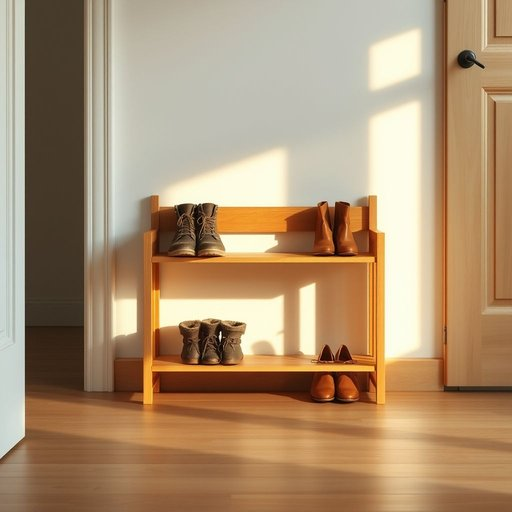

# shoe-rack

<h1 style="font-size: 2.5em; font-weight: 300; letter-spacing: 2px; margin: 0; color: #2c3e50;">
/shoe-rack*/
</h1>

---

---

## 例句

Every evening, before settling down with a cup of tea in the living room, she meticulously arranges the muddy boots and delicate leather shoes on the shoe-rack by the front door, which, despite its modest size, manages to keep the hallway remarkably tidy and free from clutter.

*Every(/ˈɛvəri/) evening,(/ˈivnɪŋ,/) before(/ˌbiˈfɔr/) settling(/ˈsɛtəlɪŋ/) down(/daʊn/) with(/wɪθ/) a(/ə/) cup(/kəp/) of(/əv/) tea(/ti/) in(/ɪn/) the(/ðə/) living(/ˈlɪvɪŋ/) room,(/rum,/) she(/ʃi/) meticulously(/məˈtɪkjələsli/) arranges(/ərˈeɪnʤɪz/) the(/ðə/) muddy(/ˈmədi/) boots(/buts/) and(/ənd/) delicate(/ˈdɛləkət/) leather(/ˈlɛðər/) shoes(/ʃuz/) on(/ɔn/) the(/ðə/) shoe-rack(/shoe-rack*/) by(/baɪ/) the(/ðə/) front(/frənt/) door,(/dɔr,/) which,(/wɪʧ,/) despite(/dɪˈspaɪt/) its(/ɪts/) modest(/ˈmɑdəst/) size,(/saɪz,/) manages(/ˈmænɪʤɪz/) to(/tɪ/) keep(/kip/) the(/ðə/) hallway(/ˈhɔlˌweɪ/) remarkably(/rɪˈmɑrkəbli/) tidy(/ˈtaɪdi/) and(/ənd/) free(/fri/) from(/frəm/) clutter.(/ˈklətər./)*

**翻译：** 每晚，在客厅端起一杯茶安坐之前，她都会仔细地将泥泞的靴子和精致的皮鞋整齐地摆放在玄关旁那个虽小巧却能让走廊保持整洁无杂的鞋架上。

---

## 解释

英语单词 "shoe-rack" 作为名词，指的是用于存放和摆放鞋子的架子或置物架，主要出现在家庭、办公室或公共场所的入口、走廊或鞋柜附近，方便人们整理和存取鞋子，保持环境整洁。在实际使用中，"shoe-rack" 通常用于描述家居生活用品，尤其是在提及收纳、组织空间时较为常见。英语学习者在使用该词时需注意其构成形式是复合名词，由名词 "shoe"（鞋）和 "rack"（架子）组成，复合词整体作单数或复数使用时，复数形式通常为 "shoe-racks"；此外，"shoe rack" 可以连写或用连字符连接，书写时两种形式均被接受，但连字符形式更强调词语整体作为一个单位。常见搭配包括 "wooden shoe-rack"（木制鞋架）、"metal shoe-rack"（金属鞋架）、"shoe-rack organizer" 等。在表达技巧上，如果想强调功能或设计，可用形容词或短语修饰，如 "a spacious shoe-rack"（宽敞的鞋架）。词源方面，"shoe-rack" 是典型的英语复合词，直接由 "shoe" 和表示支架、架子的 "rack" 组合而成， "rack" 起源于中古英语，原指用于悬挂或摆放物品的架子，延伸至各种功能性置物架。"shoe-rack" 这一组合反映了英语中通过合成词明确表达具体用途的语言习惯。在中文语境中，"shoe-rack" 准确的翻译是“鞋架”或“鞋柜架”，根据具体实物大小和功能可以细分为“鞋架”“鞋柜”等，表达的是相同的收纳鞋子的家居用品概念。该词无明显褒贬色彩或特殊文化内涵，属于中性实用词汇，主要关注其功能用途，是家庭日常生活中常见的物品名称，便于理解和应用。

---

<small style="color: #999; font-size: 0.9em;">2025-07-17 06:22:40</small>

