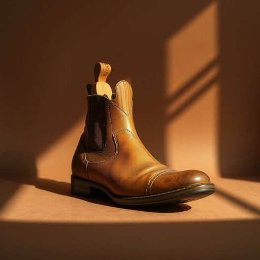

# shoe-tree

<h1 style="font-size: 2.5em; font-weight: 300; letter-spacing: 2px; margin: 0; color: #2c3e50;">
/shoe-tree*/
</h1>

---

---

## 例句

Whenever I take off my boots after a long day, I immediately insert the cedar shoe-tree inside, which not only helps maintain their shape and prevents creasing but also absorbs any lingering moisture, ensuring they stay fresh and ready for the next wear.

*Whenever(/wɛˈnɛvər/) I(/aɪ/) take(/teɪk/) off(/ɔf/) my(/maɪ/) boots(/buts/) after(/ˈæftər/) a(/ə/) long(/lɔŋ/) day,(/deɪ,/) I(/aɪ/) immediately(/ˌɪˈmiˌdiətli/) insert(/ˌɪnˈsərt/) the(/ðə/) cedar(/ˈsidər/) shoe-tree(/shoe-tree*/) inside,(/ˌɪnˈsaɪd,/) which(/wɪʧ/) not(/nɑt/) only(/ˈoʊnli/) helps(/hɛlps/) maintain(/meɪnˈteɪn/) their(/ðɛr/) shape(/ʃeɪp/) and(/ənd/) prevents(/prɪˈvɛnts/) creasing(/creasing*/) but(/bət/) also(/ˈɔlsoʊ/) absorbs(/əbˈzɔrbz/) any(/ˈɛni/) lingering(/ˈlɪŋgərɪŋ/) moisture,(/ˈmɔɪsʧər,/) ensuring(/ɪnˈʃʊrɪŋ/) they(/ðeɪ/) stay(/steɪ/) fresh(/frɛʃ/) and(/ənd/) ready(/ˈrɛdi/) for(/fər/) the(/ðə/) next(/nɛkst/) wear.(/wɛr./)*

**翻译：** 每当我长时间穿着靴子脱下后，会立刻将雪松鞋撑插入其中，这不仅有助于保持鞋型，防止起皱，还能吸收残留的湿气，确保靴子保持清新，随时准备下一次穿用。

---

## 解释

英语单词“shoe-tree”在家居生活用品语境中作为名词，指的是一种放入鞋内用以保持鞋型、防止鞋子变形和吸湿的木制或塑料制品，常见于皮鞋或较为正式的鞋类保存和保养过程中。具体使用场合通常是在日常家庭鞋柜整理、鞋类护理或鞋店售后服务中，帮助维护鞋子的形状和延长使用寿命。英语学习者在使用“shoe-tree”时需注意该词为复合名词，单复数形式分别为“shoe-tree”与“shoe-trees”，常用于搭配动词如“use a shoe-tree”，“insert shoe-trees into shoes”或形容词搭配如“wooden shoe-tree”，“adjustable shoe-tree”等，表达时应确保与鞋类护理相关的语境一致。该词源自英语中“shoe”（鞋）和“tree”（树，框架）两词组合，传统上“tree”在此指代用于固定或撑起物体形状的框架结构，类似木制模具的含义，起源于18世纪以木质材料制成的鞋撑用于保持鞋形的工艺。中文环境中，“shoe-tree”准确翻译为“鞋撑”或“鞋楦”，其中“鞋撑”是最通用且通俗的表达，强调辅助鞋子保持形态的功能；“鞋楦”则更专业，常用于制鞋工艺中指代鞋模。该词本身无褒贬色彩，也不存在特殊文化内涵，属于实用的家居生活用品名称，学习时应结合具体鞋类保养情境理解使用。

---

<small style="color: #999; font-size: 0.9em;">2025-07-17 06:22:40</small>

