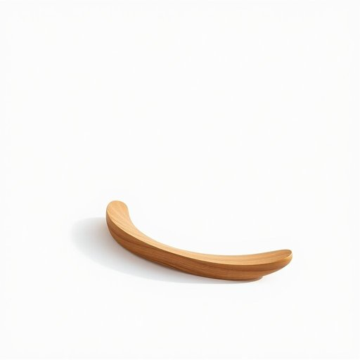

# shoehorn

<h1 style="font-size: 2.5em; font-weight: 300; letter-spacing: 2px; margin: 0; color: #2c3e50;">
/ˈʃuˌhɔrn/
</h1>

---

---

## 例句

Whenever the director demanded the script revisions, the screenplay, filled with intricate character developments and unexpected plot twists, became the cornerstone of the film’s eventual critical acclaim and audience engagement.

*Whenever(/wɛˈnɛvər/) the(/ðə/) director(/dɪˈrɛktər/) demanded(/dɪˈmændɪd/) the(/ðə/) script(/skrɪpt/) revisions,(/riˈvɪʒənz,/) the(/ðə/) screenplay,(/ˈskrinˌpleɪ,/) filled(/fɪld/) with(/wɪθ/) intricate(/ˈɪntrəkət/) character(/ˈkɛrɪktər/) developments(/dɪˈvɛləpmənts/) and(/ənd/) unexpected(/ˌənɪkˈspɛktɪd/) plot(/plɑt/) twists,(/twɪsts,/) became(/bɪˈkeɪm/) the(/ðə/) cornerstone(/ˈkɔrnərˌstoʊn/) of(/əv/) the(/ðə/) film’s(/film’s*/) eventual(/əˈvɛnʧuəl/) critical(/ˈkrɪtɪkəl/) acclaim(/əˈkleɪm/) and(/ənd/) audience(/ˈɔdiəns/) engagement.(/ɛnˈgeɪʤmənt./)*

**翻译：** 每当导演要求修改剧本时，这部剧本因其复杂的人物塑造和出人意料的情节转折，最终成为影片获得高度评价和观众喜爱的基石。

---

## 解释

英语单词“shoehorn”作为名词，在家居生活用品的语境中指的是一种细长而略呈弯曲的工具，用来帮助人们将脚轻松地滑入鞋内，避免鞋跟被挤压变形或脱落。具体使用场合通常是在穿鞋时，特别是穿较紧或硬质鞋款时，使用shoehorn可以减少穿鞋的困难和对鞋子的损伤。英语学习者在使用该词时应注意其作为可数名词，可以用复数形式“shoehorns”，且常见表达有“use a shoehorn”（使用鞋拔）和“slip on with a shoehorn”（借助鞋拔穿鞋）。shoehorn一词源于古英语“sceohorn”，由“shoe”（鞋）和“horn”（角，指传统上用动物角制成的工具）组成，体现了早期用动物角制成的鞋拔工具的特征。该词在中文语境中的准确翻译为“鞋拔”或“鞋拔子”，是指代用来辅助穿鞋的小工具，具有明确且实用的含义，无贬义或特殊文化色彩，通常用于日常生活中体现便利和细节关怀的语境中。

---

<small style="color: #999; font-size: 0.9em;">2025-07-17 06:22:40</small>

