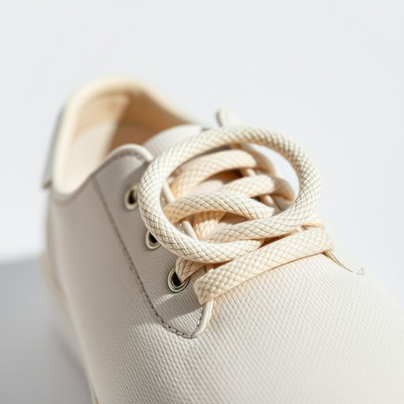

# shoelace

<h1 style="font-size: 2.5em; font-weight: 300; letter-spacing: 2px; margin: 0; color: #2c3e50;">
/ˈʃuˌleɪs/
</h1>

---

---

## 例句

The knowledge she gained from years of study enabled her to solve problems that others found impossible.

*The(/ðə/) knowledge(/ˈnɑlɪʤ/) she(/ʃi/) gained(/geɪnd/) from(/frəm/) years(/jɪrz/) of(/əv/) study(/ˈstədi/) enabled(/ɪˈneɪbəld/) her(/hər/) to(/tɪ/) solve(/sɑlv/) problems(/ˈprɑbləmz/) that(/ðət/) others(/ˈəðərz/) found(/faʊnd/) impossible.(/ˌɪmˈpɑsəbəl./)*

**翻译：** 她多年苦学所得的知识，使她能够解决他人难以克服的问题。

---

## 解释

单词shoelace作为名词在家居生活用品的语境中指的是鞋带即用于系鞋子的细长带子通常由布或合成材料制成具体使用场合多见于描述日常生活中穿鞋系鞋带或鞋子维护相关的情境如我需要一根新的鞋带或请帮我系好鞋带英语学习者需要注意shoelace在语法上为可数名词其复数形式为shoelaces常见搭配包括tie your shoelaces系鞋带loose shoelace松开的鞋带replace shoelaces更换鞋带等表达在使用时shoelace通常与动词tieloosentighten等搭配表达具体动作词源方面shoelace由shoe鞋与lace带子系带复合组成lace一词源自中世纪拉丁语ligare意为绑扎反映出其用来固定鞋子的功能在中文语境中shoelace准确翻译为鞋带它是一个中性词汇无贬义或特殊褒义色彩属于生活中常见的实物名词体现了一种基础的生活用品便于理解和使用

---

<small style="color: #999; font-size: 0.9em;">2025-07-17 06:22:40</small>

