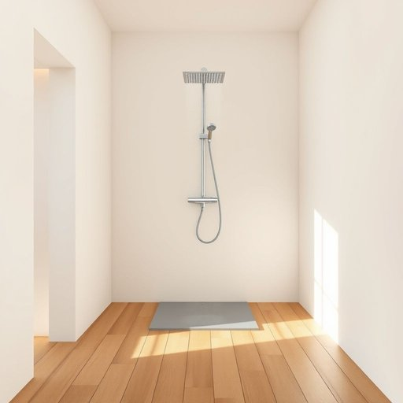

# shower

<h1 style="font-size: 2.5em; font-weight: 300; letter-spacing: 2px; margin: 0; color: #2c3e50;">
/ʃaʊər/
</h1>

---

---

## 例句

After a long day of work, when the cold rain had soaked through my coat and left me shivering, I couldn’t wait to step into the warm shower, with its powerful jets and adjustable temperature settings, which not only washed away the fatigue but also refreshed my mind for the evening ahead.

*After(/ˈæftər/) a(/ə/) long(/lɔŋ/) day(/deɪ/) of(/əv/) work,(/wərk,/) when(/wɪn/) the(/ðə/) cold(/koʊld/) rain(/reɪn/) had(/hæd/) soaked(/soʊkt/) through(/θru/) my(/maɪ/) coat(/koʊt/) and(/ənd/) left(/lɛft/) me(/mi/) shivering,(/ˈʃɪvərɪŋ,/) I(/aɪ/) couldn’t(/couldn’t*/) wait(/weɪt/) to(/tɪ/) step(/stɛp/) into(/ˈɪntu/) the(/ðə/) warm(/wɔrm/) shower,(/ʃaʊər,/) with(/wɪθ/) its(/ɪts/) powerful(/ˈpaʊərfəl/) jets(/ʤɛts/) and(/ənd/) adjustable(/əˈʤəstəbəl/) temperature(/ˈtɛmpərəʧər/) settings,(/ˈsɛtɪŋz,/) which(/wɪʧ/) not(/nɑt/) only(/ˈoʊnli/) washed(/wɑʃt/) away(/əˈweɪ/) the(/ðə/) fatigue(/fəˈtig/) but(/bət/) also(/ˈɔlsoʊ/) refreshed(/riˈfrɛʃt/) my(/maɪ/) mind(/maɪnd/) for(/fər/) the(/ðə/) evening(/ˈivnɪŋ/) ahead.(/əˈhɛd./)*

**翻译：** 经过漫长的一天劳作，寒冷的雨水浸透了我的大衣，使我不禁瑟瑟发抖，我迫不及待地走进温暖的淋浴间，感受着强劲的水流和可调节的水温，这不仅冲洗去了疲惫，也让我的思绪焕然一新，为即将到来的夜晚做好准备。

---

## 解释

英语单词'shower'在家居生活用品语境中作为名词，通常指淋浴装置，即用来喷洒水流以便人们清洁身体的设备，如浴室内的淋浴头或整体淋浴设施。具体使用场合包括描述浴室设备、谈论洗浴习惯或装修设计时，例如“When we remodeled the bathroom, we installed a modern shower.”英语学习者使用该词时应注意其作为可数名词时通常指具体的淋浴装置，而不可与指某次淋浴经历的“take a shower”混淆，后者中“shower”是与“take”连用表达“洗淋浴”的动作；常见搭配有“shower head”（淋浴喷头）、“shower stall”（淋浴间）、“rain shower”（雨淋式淋浴）等，且注意词形复数为'showers'，表示多套淋浴装置。词源上，“shower”源自中古英语，来自古法语“showere”，其更早根源为古英语“scūr”，意为“阵雨”或“倾泻的水”，引申为喷洒的水流，后用于指代淋浴装置。中文语境中，“shower”应准确翻译为“（淋浴）喷头”或“淋浴装置”，根据上下文也可指“淋浴间”或“一场淋浴”，强调其为现代家庭卫浴中常见的洗浴设施，无特殊褒贬色彩，但在文化上反映了讲究卫生和便利生活的生活方式，需注意区分“shower”和“bath”以体现淋浴与泡澡的不同。

---

<small style="color: #999; font-size: 0.9em;">2025-07-17 06:22:40</small>

