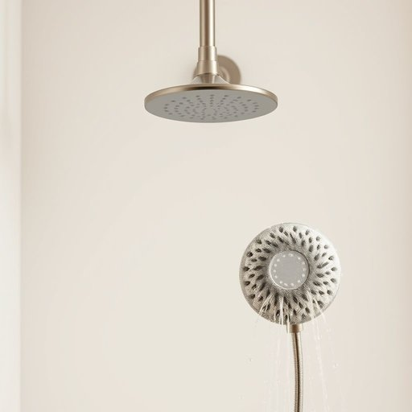

# showerhead

<h1 style="font-size: 2.5em; font-weight: 300; letter-spacing: 2px; margin: 0; color: #2c3e50;">
/showerhead*/
</h1>

---

---

## 例句

After noticing that the water pressure in the bathroom was unusually low and uneven, I decided to remove the old, lime-encrusted showerhead, which had clearly not been cleaned in years, in order to replace it with a new, adjustable model that promises a more invigorating and efficient shower experience.

*After(/ˈæftər/) noticing(/ˈnoʊtɪsɪŋ/) that(/ðət/) the(/ðə/) water(/ˈwɔtər/) pressure(/ˈprɛʃər/) in(/ɪn/) the(/ðə/) bathroom(/ˈbæθˌrum/) was(/wɑz/) unusually(/ənˈjuˌʒuəli/) low(/loʊ/) and(/ənd/) uneven,(/əˈnivən,/) I(/aɪ/) decided(/ˌdɪˈsaɪdɪd/) to(/tɪ/) remove(/riˈmuv/) the(/ðə/) old,(/oʊld,/) lime-encrusted(/lime-encrusted*/) showerhead,(/showerhead*,/) which(/wɪʧ/) had(/hæd/) clearly(/ˈklɪrli/) not(/nɑt/) been(/bɪn/) cleaned(/klind/) in(/ɪn/) years,(/jɪrz,/) in(/ɪn/) order(/ˈɔrdər/) to(/tɪ/) replace(/ˌriˈpleɪs/) it(/ɪt/) with(/wɪθ/) a(/ə/) new,(/nu,/) adjustable(/əˈʤəstəbəl/) model(/ˈmɑdəl/) that(/ðət/) promises(/ˈprɑməsəz/) a(/ə/) more(/mɔr/) invigorating(/ˌɪnˈvɪgərˌeɪtɪŋ/) and(/ənd/) efficient(/ɪˈfɪʃənt/) shower(/ʃaʊər/) experience.(/ɪkˈspɪriəns./)*

**翻译：** 注意到浴室的水压异常低且不均匀后，我决定拆下那款多年未曾清洗、满是水垢的旧淋浴头，换上一个新型的可调节淋浴头，以期带来更振奋人心且更高效的淋浴体验。

---

## 解释

showerhead作为名词，指的是淋浴器上的喷头，是家居生活用品中用于将水均匀喷洒出来供人洗浴的装置。具体使用场合多见于浴室装修、卫浴设备介绍、家庭用品购买或维修等语境中，比如换一个新的showerhead表示更换淋浴喷头。英语学习者在使用该词时应注意它是一个复合名词，由shower（淋浴）和head（头部、喷头）构成，通常作可数名词用，复数形式为showerheads。常见搭配包括adjustable showerhead（可调节喷头）、fixed showerhead（固定式喷头）、showerhead holder（喷头支架）等。在句子中，showerhead一般作主语、宾语或定语使用，如The showerhead is leaking或a new showerhead design。该词源于英文中shower意为淋浴，而head在设备中常用来表示输出水流的部分，两者合成便指喷洒淋浴水流的装置。中文中准确翻译为淋浴喷头或简写为花洒，为日常生活中常见且中性词汇，无褒贬含义或特殊文化色彩，仅指具体的卫浴配件。

---

<small style="color: #999; font-size: 0.9em;">2025-07-17 06:22:40</small>

