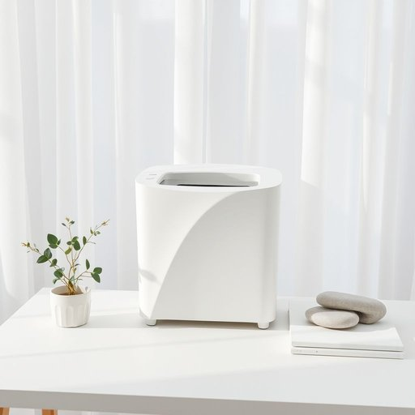

# shredder

<h1 style="font-size: 2.5em; font-weight: 300; letter-spacing: 2px; margin: 0; color: #2c3e50;">
/ʃˈrɛdər/
</h1>

---

---

## 例句

Before our meeting, I wanted to discuss the organisation of documents, especially considering the importance of the shredder’s functionality and its role in ensuring document security to prevent any potential identity theft.

*Before(/ˌbiˈfɔr/) our(/ɑr/) meeting,(/ˈmitɪŋ,/) I(/aɪ/) wanted(/ˈwɔntɪd/) to(/tɪ/) discuss(/dɪˈskəs/) the(/ðə/) organisation(/ˌɔrgənɪˈzeɪʃən/) of(/əv/) documents,(/ˈdɑkjəmənts,/) especially(/əˈspɛʃəli/) considering(/kənˈsɪdərɪŋ/) the(/ðə/) importance(/ˌɪmˈpɔrtəns/) of(/əv/) the(/ðə/) shredder’s(/shredder’s*/) functionality(/ˌfəŋkʃəˈnælɪti/) and(/ənd/) its(/ɪts/) role(/roʊl/) in(/ɪn/) ensuring(/ɪnˈʃʊrɪŋ/) document(/ˈdɑkjəmɛnt/) security(/sɪˈkjʊrəti/) to(/tɪ/) prevent(/prɪˈvɛnt/) any(/ˈɛni/) potential(/pəˈtɛnʃəl/) identity(/aɪˈdɛntəˌti/) theft.(/θɛft./)*

**翻译：** 在我们开会之前，我想先讨论一下文件的整理工作，特别是考虑到碎纸机的功能重要性及其在保障文件安全、防止潜在身份盗用方面所起的作用。

---

## 解释

单词“shredder”作为名词在家居生活用品语境中，主要指碎纸机，即一种用于将纸张撕成细条或小片以保护隐私、防止信息泄露的电动或手动设备。具体使用场合通常是在家庭办公环境中，帮助处理重要文件、账单或个人资料，防止被他人获取或滥用。英语学习者在使用“shredder”时应注意其单复数形式“shredders”及其与动词“shred”（撕碎、切成条状）的区别，常见搭配包括“paper shredder”（碎纸机）、“document shredder”和“to use a shredder”等。该词来源于动词“shred”（撕成条状、切碎），属于现代英语工业产品命名中较为直观的派生词，体现了该设备的功能。中文语境中，“shredder”准确译为“碎纸机”，强调其在日常生活和办公场景中保护信息安全的重要作用。此词本身无褒贬色彩，属于中性词，文化含义集中在防护隐私和数据安全的现代社会需求上，反映了信息时代对保密措施的重视。

---

<small style="color: #999; font-size: 0.9em;">2025-07-17 06:22:40</small>

