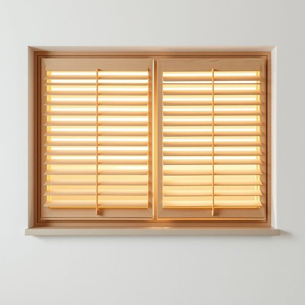

# shutter

<h1 style="font-size: 2.5em; font-weight: 300; letter-spacing: 2px; margin: 0; color: #2c3e50;">
/ˈʃətər/
</h1>

---

---

## 例句

Could you please make sure the kitchen shutter is fully closed before you leave, as it not only helps keep the morning light out but also provides an extra layer of insulation against the chilly draft that tends to come through the old window frame?

*Could(/kʊd/) you(/ju/) please(/pliz/) make(/meɪk/) sure(/ʃʊr/) the(/ðə/) kitchen(/ˈkɪʧən/) shutter(/ˈʃətər/) is(/ɪz/) fully(/ˈfʊli/) closed(/kloʊzd/) before(/ˌbiˈfɔr/) you(/ju/) leave,(/liv,/) as(/ɛz/) it(/ɪt/) not(/nɑt/) only(/ˈoʊnli/) helps(/hɛlps/) keep(/kip/) the(/ðə/) morning(/ˈmɔrnɪŋ/) light(/laɪt/) out(/aʊt/) but(/bət/) also(/ˈɔlsoʊ/) provides(/prəˈvaɪdz/) an(/ən/) extra(/ˈɛkstrə/) layer(/leɪər/) of(/əv/) insulation(/ˌɪnsəˈleɪʃən/) against(/əˈgɛnst/) the(/ðə/) chilly(/ˈʧɪli/) draft(/dræft/) that(/ðət/) tends(/tɛndz/) to(/tɪ/) come(/kəm/) through(/θru/) the(/ðə/) old(/oʊld/) window(/ˈwɪndoʊ/) frame?(/freɪm?/)*

**翻译：** 请您离开前务必确认厨房的卷帘门已完全关闭，这不仅有助于阻挡晨光，还能为透过旧窗框吹入的寒风提供额外的隔热保护。

---

## 解释

英语单词shutter在家居生活用品语境中作为名词主要指装在窗户外侧的可开合的百叶窗或遮板，用于遮挡阳光、防风雨或保护隐私，常见于住宅、别墅和商铺的窗户上。在具体使用场合上，shutter多用于描述外置的木质、金属或塑料材质的窗户防护装置，常见表达如close the shutters表示关闭百叶窗以阻挡光线，或wooden shutters指木制百叶窗。英语学习者使用该词时应注意其作为名词时常与动词close、open、install等搭配，同时注意区分室内的窗帘（curtain、drape）与室外的shutter，shutter在复数形式时为shutters。词源方面，shutter源自中古英语shut，意指关闭，借指能够关闭的装置，反映了其主要功能，即通过物理遮挡实现窗户的封闭保护。在中文语境中，shutter通常准确翻译为百叶窗或外遮板，强调其安装于窗户外部并具有调节光线和保护作用的功能，且与室内窗帘不同。该词在家居用语中无明显褒贬色彩，属于中性词汇，但在某些文化环境中，关闭shutters可能暗示避世或保护隐私，具有一定的象征意义。

---

<small style="color: #999; font-size: 0.9em;">2025-07-17 06:22:40</small>

