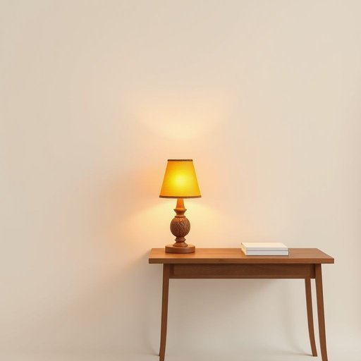

# side-lamp

<h1 style="font-size: 2.5em; font-weight: 300; letter-spacing: 2px; margin: 0; color: #2c3e50;">
/side-lamp*/
</h1>

---

---

## 例句

Despite the late hour and the soft hum of the city outside, I reached for the side-lamp, whose delicately carved wooden frame and amber glass shade cast a soothing glow that transformed the otherwise austere study into a sanctuary of warmth and tranquility, perfect for unraveling the complex plot of the novel resting on my desk.

*Despite(/dɪˈspaɪt/) the(/ðə/) late(/leɪt/) hour(/aʊər/) and(/ənd/) the(/ðə/) soft(/sɔft/) hum(/həm/) of(/əv/) the(/ðə/) city(/ˈsɪti/) outside,(/ˈaʊtˈsaɪd,/) I(/aɪ/) reached(/riʧt/) for(/fər/) the(/ðə/) side-lamp,(/side-lamp*,/) whose(/huz/) delicately(/ˈdɛləkətli/) carved(/kɑrvd/) wooden(/ˈwʊdən/) frame(/freɪm/) and(/ənd/) amber(/ˈæmbər/) glass(/glæs/) shade(/ʃeɪd/) cast(/kæst/) a(/ə/) soothing(/ˈsuðɪŋ/) glow(/gloʊ/) that(/ðət/) transformed(/trænsˈfɔrmd/) the(/ðə/) otherwise(/ˈəðərˌwaɪz/) austere(/ɔˈstɪr/) study(/ˈstədi/) into(/ˈɪntu/) a(/ə/) sanctuary(/ˈsæŋkʧuˌɛri/) of(/əv/) warmth(/wɔrmθ/) and(/ənd/) tranquility,(/træŋkˈwɪlɪti,/) perfect(/ˈpərˌfɪkt/) for(/fər/) unraveling(/ənˈrævəlɪŋ/) the(/ðə/) complex(/ˈkɑmplɛks/) plot(/plɑt/) of(/əv/) the(/ðə/) novel(/ˈnɑvəl/) resting(/ˈrɛstɪŋ/) on(/ɔn/) my(/maɪ/) desk.(/dɛsk./)*

**翻译：** 尽管夜已深，窗外城市的低沉嗡鸣依然存在，我还是伸手打开了那盏台灯。它那精致雕刻的木质灯架和琥珀色的玻璃灯罩散发出柔和的光芒，将原本严肃的书房转变为温馨宁静的避风港，恰好适合我理清桌上那本小说错综复杂的情节。

---

## 解释

“side-lamp”作为名词，主要指放置在床头柜、沙发旁或书桌侧边，用于局部照明的小型台灯或壁灯，常见于家居生活用品场景中，帮助营造温馨、柔和的光线环境，方便阅读或夜间照明。具体使用场合多为卧室、客厅或书房，语境通常涉及家居布置、灯具选择或室内照明设计。英语学习者在使用该词时应注意其复合结构，side与lamp之间常用连字符连接，且作名词使用时通常不变形，“side-lamp”多用作单数或复数（side-lamps）形式出现；常见搭配有“turn on/off the side-lamp”（开关灯）、“a bedside side-lamp”（床头灯的一种）等。此外，side-lamp与table lamp或desk lamp有细微区别，强调放置位置“侧边”。词源上，“side”意指“侧面”，结合“lamp”表示灯具，整体描绘了灯具放置在空间一侧的功能特点，起源于对家居照明设备分类的直观描述。在中文语境中，“side-lamp”准确翻译为“侧灯”或“边灯”，指的是放置在侧边的照明灯具，常常与床头灯、台灯等概念部分重叠，但侧灯更突出其位置和辅助照明作用。在使用时，需注意根据具体环境选用合适的中文词汇，如“床头灯”更具体便于理解。该词通常无特殊褒贬色彩或文化内涵，属于中性实用名词，强调功能与位置关系，适用于描述家居照明设备时的专业或日常表达。

---

<small style="color: #999; font-size: 0.9em;">2025-07-17 06:22:40</small>

