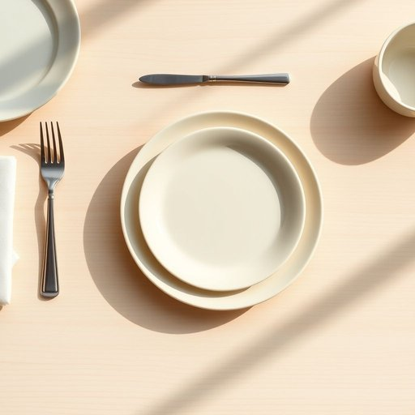

# side-plate

<h1 style="font-size: 2.5em; font-weight: 300; letter-spacing: 2px; margin: 0; color: #2c3e50;">
/side-plate*/
</h1>

---

---

## 例句

Could you please set the table with the side-plates, along with the main dinner plates and salad bowls, making sure that each side-plate is placed to the left of the forks, so that when we serve the starters and bread rolls, everyone has easy access without cluttering the table?

*Could(/kʊd/) you(/ju/) please(/pliz/) set(/sɛt/) the(/ðə/) table(/ˈteɪbəl/) with(/wɪθ/) the(/ðə/) side-plates,(/side-plates*,/) along(/əˈlɔŋ/) with(/wɪθ/) the(/ðə/) main(/meɪn/) dinner(/ˈdɪnər/) plates(/pleɪts/) and(/ənd/) salad(/ˈsæləd/) bowls,(/boʊlz,/) making(/ˈmeɪkɪŋ/) sure(/ʃʊr/) that(/ðət/) each(/iʧ/) side-plate(/side-plate*/) is(/ɪz/) placed(/pleɪst/) to(/tɪ/) the(/ðə/) left(/lɛft/) of(/əv/) the(/ðə/) forks,(/fɔrks,/) so(/soʊ/) that(/ðət/) when(/wɪn/) we(/wi/) serve(/sərv/) the(/ðə/) starters(/ˈstɑrtərz/) and(/ənd/) bread(/brɛd/) rolls,(/roʊlz,/) everyone(/ˈɛvriˌwən/) has(/həz/) easy(/ˈizi/) access(/ˈækˌsɛs/) without(/wɪˈθaʊt/) cluttering(/ˈklətərɪŋ/) the(/ðə/) table?(/ˈteɪbəl?/)*

**翻译：** 请您将餐具摆好，除了主晚餐盘和沙拉碗外，还请摆上边盘，并确保每个边盘都放置在叉子的左侧，这样在上前菜和面包卷时，大家都能方便取用，且不会使餐桌显得杂乱。

---

## 解释

“side-plate”作为名词在家居生活用品语境中通常指餐桌旁的一个小盘子，用于盛放餐具、面包、小菜或配餐，常见于正式用餐时的摆设或茶点时使用。具体使用场合包括家庭聚餐、宴会、下午茶或餐厅等场合，目的是分开主菜盘与辅食或点心，保持餐桌整洁有序。英语学习者在使用“side-plate”时需要注意它是可数名词，常用复数形式“side-plates”，且通常和“main plate”或“dinner plate”搭配出现，比如“place the bread on the side-plate”（将面包放在小盘子上）。另外，side-plate多用于正式或礼仪较为讲究的饮食环境中，与日常随意用餐时常用的“plate”形成区别。该词源自side和plate的合成词，side意为“旁边的”，plate意为“盘子”，表达了其作为辅佐主餐盘放置于一侧的功能。在中文语境中，最精准的翻译是“小盘子”或“配餐小盘”，强调它作为辅助餐具的用途，避免与“大盘子”混淆。需要注意的是，side-plate无特殊褒贬含义或文化色彩，属于中性词，更多体现的是一种餐桌礼仪的细节规范。

---

<small style="color: #999; font-size: 0.9em;">2025-07-17 06:22:40</small>

