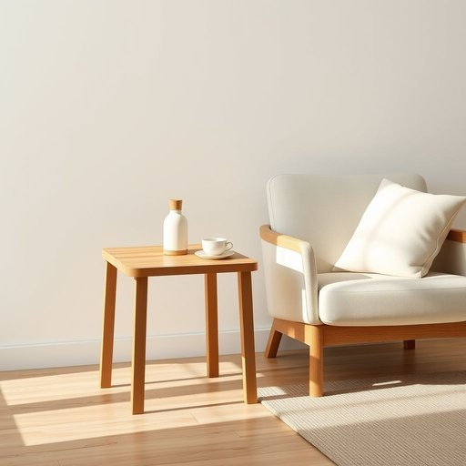

# side-table

<h1 style="font-size: 2.5em; font-weight: 300; letter-spacing: 2px; margin: 0; color: #2c3e50;">
/side-table*/
</h1>

---

---

## 例句

Could you please move the side-table next to the armchair in the living room so that I can place my reading lamp and a cup of tea on the side-table while I settle down with this novel, which I’ve been meaning to start for weeks?

*Could(/kʊd/) you(/ju/) please(/pliz/) move(/muv/) the(/ðə/) side-table(/side-table*/) next(/nɛkst/) to(/tɪ/) the(/ðə/) armchair(/ˈɑrmˌʧɛr/) in(/ɪn/) the(/ðə/) living(/ˈlɪvɪŋ/) room(/rum/) so(/soʊ/) that(/ðət/) I(/aɪ/) can(/kən/) place(/pleɪs/) my(/maɪ/) reading(/ˈrɛdɪŋ/) lamp(/læmp/) and(/ənd/) a(/ə/) cup(/kəp/) of(/əv/) tea(/ti/) on(/ɔn/) the(/ðə/) side-table(/side-table*/) while(/waɪl/) I(/aɪ/) settle(/ˈsɛtəl/) down(/daʊn/) with(/wɪθ/) this(/ðɪs/) novel,(/ˈnɑvəl,/) which(/wɪʧ/) I’ve(/i’ve*/) been(/bɪn/) meaning(/ˈminɪŋ/) to(/tɪ/) start(/stɑrt/) for(/fər/) weeks?(/wiks?/)*

**翻译：** 您能否将客厅里的边桌移到扶手椅旁边，这样我就可以在边桌上摆放阅读灯和一杯茶，安坐下来读这本我已经想开始读好几周的小说？

---

## 解释

英语单词"side-table"作为名词，指的是置放在客厅、卧室等居室中主家具旁的小型桌子，通常用于放置台灯、书籍、饮品或装饰品，常见于沙发旁或床边，方便取用日常小物件，体现其辅助功能。在使用该词时需要注意它是一个复合名词，复数形式应为"side-tables"，且通常与表示位置或功能的词汇搭配使用，如"next to the sofa"（沙发旁边的边桌）、"a lamp on the side-table"（边桌上的台灯），表达时常结合具体环境以突出其实用性和位置特点。词源方面，“side”指“旁边”，而“table”是“桌子”，合起来形象描述了放置于主要家具“侧边”的小桌子，这一词汇反映了家居布局中辅助家具的分类传统。在中文语境中，“side-table”准确翻译为“边桌”或“边几”，强调其在空间中的辅助作用，与“茶几”、“小桌子”存在一定区别，因其特定放置位置和用途，一般无褒贬含义，属于中性词汇，文化上反映了西方家居对功能性与便利性的注重，适合形容家居设计中实用与装饰并重的小型家具。

---

<small style="color: #999; font-size: 0.9em;">2025-07-17 06:22:40</small>

