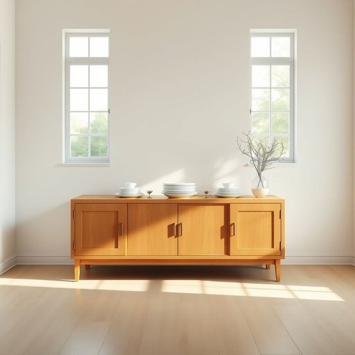

# sideboard

<h1 style="font-size: 2.5em; font-weight: 300; letter-spacing: 2px; margin: 0; color: #2c3e50;">
/sideboard*/
</h1>

---

---

## 例句

In the dining room, where the sunlight streamed through the tall windows casting intricate patterns on the polished wooden floor, she carefully arranged the delicate china plates and antique silverware on the sideboard, which, having been a treasured family heirloom for generations, not only served as a practical storage unit but also added an unmistakable touch of elegance and history to the otherwise modern decor.

*In(/ɪn/) the(/ðə/) dining(/ˈdaɪnɪŋ/) room,(/rum,/) where(/wɛr/) the(/ðə/) sunlight(/ˈsənˌlaɪt/) streamed(/strimd/) through(/θru/) the(/ðə/) tall(/tɔl/) windows(/ˈwɪndoʊz/) casting(/ˈkæstɪŋ/) intricate(/ˈɪntrəkət/) patterns(/ˈpætərnz/) on(/ɔn/) the(/ðə/) polished(/ˈpɑlɪʃt/) wooden(/ˈwʊdən/) floor,(/flɔr,/) she(/ʃi/) carefully(/ˈkɛrfəli/) arranged(/əreɪnʤd/) the(/ðə/) delicate(/ˈdɛləkət/) china(/ˈʧaɪnə/) plates(/pleɪts/) and(/ənd/) antique(/ænˈtik/) silverware(/ˈsɪlvərˌwɛr/) on(/ɔn/) the(/ðə/) sideboard,(/sideboard*,/) which,(/wɪʧ,/) having(/ˈhævɪŋ/) been(/bɪn/) a(/ə/) treasured(/ˈtrɛʒərd/) family(/ˈfæməli/) heirloom(/ˈɛˌrlum/) for(/fər/) generations,(/ˌʤɛnərˈeɪʃənz,/) not(/nɑt/) only(/ˈoʊnli/) served(/sərvd/) as(/ɛz/) a(/ə/) practical(/ˈpræktɪkəl/) storage(/ˈstɔrɪʤ/) unit(/ˈjunɪt/) but(/bət/) also(/ˈɔlsoʊ/) added(/ˈædɪd/) an(/ən/) unmistakable(/ˌənmɪˈsteɪkəbəl/) touch(/təʧ/) of(/əv/) elegance(/ˈɛləgəns/) and(/ənd/) history(/ˈhɪstəri/) to(/tɪ/) the(/ðə/) otherwise(/ˈəðərˌwaɪz/) modern(/ˈmɑdərn/) decor.(/ˈdeɪkɔr./)*

**翻译：** 在餐厅里，阳光透过高大的窗户洒下，在抛光的木地板上投下错综复杂的光影。她小心翼翼地将精致的瓷盘和古董银器摆放在餐边柜上。这个餐边柜作为流传了几代人的珍贵家族传家宝，不仅是实用的储物装置，还为这本来现代风格的装饰增添了一抹独特的优雅与历史气息。

---

## 解释

英语单词'sideboard'作为名词，主要指家居生活中用来储存餐具、器皿及餐厅物品的矮柜或餐边柜，通常放置于餐厅或客厅一侧，便于餐具的摆放和展示。使用场合多见于较正式的用餐环境或家庭聚会时，用以存放盘子、餐巾、酒水等物品，既具实用功能又有装饰作用。英语学习者在使用该词时需注意其作为可数名词，常用复数形式sideboards，且通常与表示位置或用途的词搭配，如“a wooden sideboard”，“the dining room sideboard”或“sideboard drawers”。此外，sideboard常与动词“place,” “open,” “store,” “clean”等搭配。词源上，sideboard源自16世纪，由“side”（旁边）和“board”（平板，桌板）组合而成，最初指附设于墙边的餐桌或置物板，后来演变为带有储物功能的柜子。中文语境中，sideboard准确翻译为“餐边柜”或“矮柜”，强调其功能性和摆放位置，属于家居家具类名词。该词无明显褒贬色彩，但在英语文化中，拥有一件精美的sideboard常被视为家庭品位和生活质量的象征，因其既实用又具装饰性，因此在较正式或传统的家居环境中较为常见。

---

<small style="color: #999; font-size: 0.9em;">2025-07-17 06:22:40</small>

