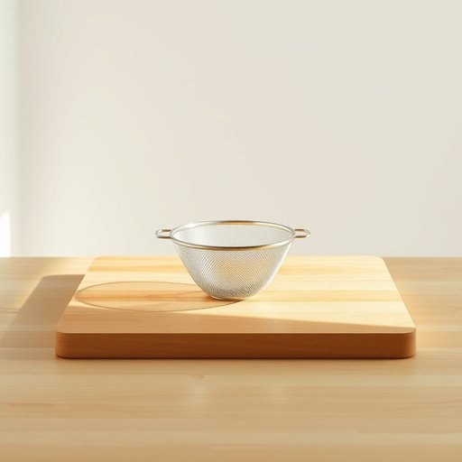

# sieve

<h1 style="font-size: 2.5em; font-weight: 300; letter-spacing: 2px; margin: 0; color: #2c3e50;">
/sɪv/
</h1>

---

---

## 例句

Before you add the flour to the mixing bowl, could you please pass me the sieve, the one with the fine mesh that Grandma gave us last Christmas, since it helps to aerate the flour and remove any lumps, ensuring the cake batter will be smooth and free of any unwanted clumps?

*Before(/ˌbiˈfɔr/) you(/ju/) add(/æd/) the(/ðə/) flour(/flaʊər/) to(/tɪ/) the(/ðə/) mixing(/ˈmɪksɪŋ/) bowl,(/boʊl,/) could(/kʊd/) you(/ju/) please(/pliz/) pass(/pæs/) me(/mi/) the(/ðə/) sieve,(/sɪv,/) the(/ðə/) one(/wən/) with(/wɪθ/) the(/ðə/) fine(/faɪn/) mesh(/mɛʃ/) that(/ðət/) Grandma(/ˈgrændmɑ/) gave(/geɪv/) us(/ˈjuˈɛs/) last(/læst/) Christmas,(/ˈkrɪsməs,/) since(/sɪns/) it(/ɪt/) helps(/hɛlps/) to(/tɪ/) aerate(/aerate*/) the(/ðə/) flour(/flaʊər/) and(/ənd/) remove(/riˈmuv/) any(/ˈɛni/) lumps,(/ləmps,/) ensuring(/ɪnˈʃʊrɪŋ/) the(/ðə/) cake(/keɪk/) batter(/ˈbætər/) will(/wɪl/) be(/bi/) smooth(/smuð/) and(/ənd/) free(/fri/) of(/əv/) any(/ˈɛni/) unwanted(/ənˈwɔntɪd/) clumps?(/kləmps?/)*

**翻译：** 在你把面粉倒入搅拌碗之前，能请你递给我那个筛子吗？就是奶奶去年圣诞节送给我们的那个细网筛，因为它有助于给面粉充气并去除结块，确保蛋糕面糊细腻顺滑，没有任何多余的颗粒。

---

## 解释

英语单词'sieve'作为名词在家居生活用品语境中，通常指带有网眼或细孔，用以过滤、过筛固体颗粒与液体混合物的器具，如厨房中用来筛面粉、过滤茶叶或去除杂质的细筛。具体使用场合多见于烹饪准备过程，如“use a sieve to sift flour”（用筛子筛面粉），或清洗蔬菜时过滤水分。英语学习者在使用'sieve'时应注意其作为可数名词，常用复数形式为'sieves'，搭配常见表达有“a fine/coarse sieve”（细筛/粗筛）、“to sift through a sieve”（通过筛子筛），此外，动词形式为“sieve”，意为“筛选”，但名词用法更普遍。词源上，'sieve'源自古英语“sife”，与其他日耳曼语言同源，体现了其在日常生活中作为过滤工具的古老功能。中文中，'sieve'准确翻译为“筛子”或“滤网”，强调其物理结构和功能，即通过细孔分离杂质或细粒。在文化或语言色彩上，'sieve'通常无褒贬含义，但在比喻用法中有时形容记忆力差或秘密泄露，如“his mind is like a sieve”（他记性差），需要根据语境区分。总体而言，作为家居生活用品的“sieve”是一个基本、实用的词汇，语义明确，便于日常交流使用。

---

<small style="color: #999; font-size: 0.9em;">2025-07-17 06:22:40</small>

