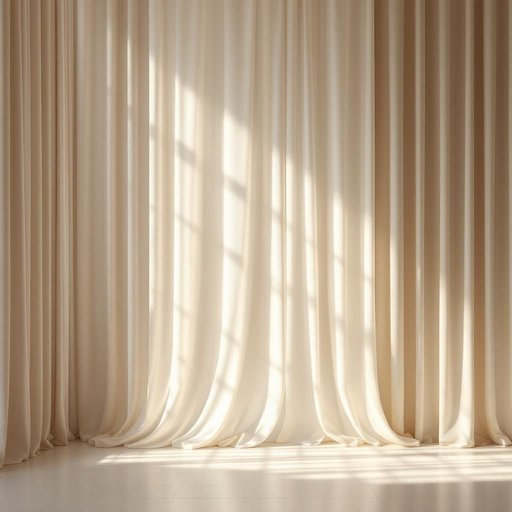

# silk

<h1 style="font-size: 2.5em; font-weight: 300; letter-spacing: 2px; margin: 0; color: #2c3e50;">
/sɪlk/
</h1>

---

---

## 例句

Although the curtains are made of a heavy cotton blend to block out the light, I insisted on adding a delicate panel of silk, which not only softens the overall appearance of the living room but also catches the sunlight in a way that brightens the entire space.

*Although(/ˌɔlˈðoʊ/) the(/ðə/) curtains(/ˈkərtənz/) are(/ər/) made(/meɪd/) of(/əv/) a(/ə/) heavy(/ˈhɛvi/) cotton(/ˈkɔtən/) blend(/blɛnd/) to(/tɪ/) block(/blɑk/) out(/aʊt/) the(/ðə/) light,(/laɪt,/) I(/aɪ/) insisted(/ˌɪnˈsɪstɪd/) on(/ɔn/) adding(/ˈædɪŋ/) a(/ə/) delicate(/ˈdɛləkət/) panel(/ˈpænəl/) of(/əv/) silk,(/sɪlk,/) which(/wɪʧ/) not(/nɑt/) only(/ˈoʊnli/) softens(/ˈsɔfənz/) the(/ðə/) overall(/ˈoʊvərˌɔl/) appearance(/əˈpɪrəns/) of(/əv/) the(/ðə/) living(/ˈlɪvɪŋ/) room(/rum/) but(/bət/) also(/ˈɔlsoʊ/) catches(/ˈkæʧɪz/) the(/ðə/) sunlight(/ˈsənˌlaɪt/) in(/ɪn/) a(/ə/) way(/weɪ/) that(/ðət/) brightens(/ˈbraɪtənz/) the(/ðə/) entire(/ɪnˈtaɪər/) space.(/speɪs./)*

**翻译：** 虽然窗帘采用厚重的棉混纺面料以遮挡光线，但我坚持在上面添加了一块精致的丝绸面板，这不仅柔化了客厅的整体氛围，还巧妙地捕捉阳光，使整个空间更加明亮。

---

## 解释

英语单词“silk”作为名词在家居生活用品的语境中，主要指由蚕丝制成的天然纤维材料，常用于制作丝绸布料、床上用品如丝绸枕套、被罩、窗帘、沙发套等高档家居装饰品，具体使用场合通常涉及强调材料质地柔软、光泽细腻、触感舒适的描述，例如“silk sheets”（丝绸床单）或“silk curtains”（丝绸窗帘），对于英语学习者而言，需注意“silk”作为不可数名词时通常不加复数形式，不宜说“silks”来指代普通的丝绸材料，当表示不同种类的丝织品时可以用复数形式“silks”，但较少见，此外，常见搭配包括“pure silk”（纯丝绸）、“silk fabric”（丝绸布料）、“silk pillowcase”（丝绸枕套）等，表达时常强调材料优质与奢华感，词源方面，“silk”源自古英语“silc”，进一步可追溯到拉丁语“silica”，而最初来源于古代丝绸之路沿线的中文“丝”的传播，体现了东西方古代丝绸贸易的文化交流意义，在中文语境中，“silk”准确翻译为“丝绸”或“蚕丝”，强调其天然动物蛋白纤维属性和高档质感，通常带有精致、优雅甚至奢侈的文化色彩，无贬义，但某些情况下也可能暗示高成本或不易打理，在家居环境中提到“silk”，往往意味着一种品质较高且带有一定身份象征的生活用品材料。

---

<small style="color: #999; font-size: 0.9em;">2025-07-17 06:22:40</small>

