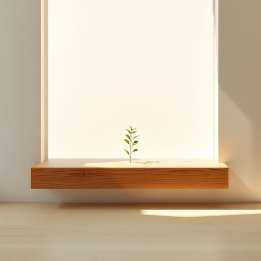

# sill

<h1 style="font-size: 2.5em; font-weight: 300; letter-spacing: 2px; margin: 0; color: #2c3e50;">
/sɪl/
</h1>

---

---

## 例句

Before the meeting, her patience was tested by the constant interruptions, turning what should have been a productive discussion into a challenge of endurance and focus.

*Before(/ˌbiˈfɔr/) the(/ðə/) meeting,(/ˈmitɪŋ,/) her(/hər/) patience(/ˈpeɪʃəns/) was(/wɑz/) tested(/ˈtɛstɪd/) by(/baɪ/) the(/ðə/) constant(/ˈkɑnstənt/) interruptions,(/ˌɪntərˈəpʃənz,/) turning(/ˈtərnɪŋ/) what(/wət/) should(/ʃʊd/) have(/hæv/) been(/bɪn/) a(/ə/) productive(/pərˈdəktɪv/) discussion(/dɪˈskəʃən/) into(/ˈɪntu/) a(/ə/) challenge(/ˈʧælənʤ/) of(/əv/) endurance(/ˈɛndərəns/) and(/ənd/) focus.(/ˈfoʊkɪs./)*

**翻译：** 会议之前，她的耐心因不断的打断而受到考验，使原本应当富有成效的讨论变成了一场对耐力和专注力的挑战。

---

## 解释

英语单词sill作为名词，在家居生活用品的语境中主要指的是窗台，即窗户底部水平延伸的那块板子或台面，常常用于放置花盆、小装饰品或者防止雨水进入室内。在具体使用场合上，sill通常出现在描述建筑构造、室内装修或家具布置时，例如window sill指窗台，或者door sill指门槛。语法上，sill作为可数名词，常与表示位置的介词连用，如on the sill（放在窗台上）、by the sill（靠近窗台），搭配动词时多用于描述放置、装饰或构造的动作，如place a vase on the sill。此外，学习者需注意该词的复数形式为sills，且常与具体建筑部件名称连用，形成复合词。词源方面，sill源自中古英语sille，进而来自古英语sil，最初意指横木或支撑木板，随着建筑技术演变，逐渐专指窗户或门框下方的水平构件。在中文语境中，sill的准确翻译为窗台或门槛，具体含义根据上下文确定。该词不存在明显的褒贬色彩或文化内涵，属于中性词汇，主要在建筑和家居表达中使用，理解时需结合具体部位和用途而非泛指一般的台或板，以避免混淆。

---

<small style="color: #999; font-size: 0.9em;">2025-07-17 06:22:40</small>

