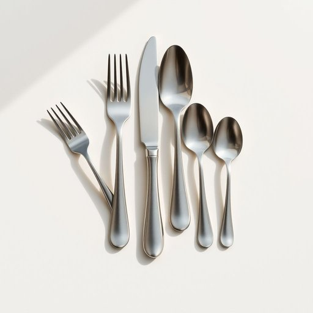

# silverware

<h1 style="font-size: 2.5em; font-weight: 300; letter-spacing: 2px; margin: 0; color: #2c3e50;">
/ˈsɪlvərˌwɛr/
</h1>

---

---

## 例句

Before we set the dining table for tonight’s dinner party, could you please polish the silverware, including the forks, knives, and spoons, which have been sitting unused in the drawer since the wedding last summer, to ensure everything looks immaculate and inviting?

*Before(/ˌbiˈfɔr/) we(/wi/) set(/sɛt/) the(/ðə/) dining(/ˈdaɪnɪŋ/) table(/ˈteɪbəl/) for(/fər/) tonight’s(/tonight’s*/) dinner(/ˈdɪnər/) party,(/ˈpɑrti,/) could(/kʊd/) you(/ju/) please(/pliz/) polish(/ˈpɑlɪʃ/) the(/ðə/) silverware,(/ˈsɪlvərˌwɛr,/) including(/ˌɪnˈkludɪŋ/) the(/ðə/) forks,(/fɔrks,/) knives,(/naɪvz,/) and(/ənd/) spoons,(/spunz,/) which(/wɪʧ/) have(/hæv/) been(/bɪn/) sitting(/ˈsɪtɪŋ/) unused(/ənˈjuzd/) in(/ɪn/) the(/ðə/) drawer(/drɔr/) since(/sɪns/) the(/ðə/) wedding(/ˈwɛdɪŋ/) last(/læst/) summer,(/ˈsəmər,/) to(/tɪ/) ensure(/ɪnˈʃʊr/) everything(/ˈɛvriˌθɪŋ/) looks(/lʊks/) immaculate(/ˌɪˈmækjulɪt/) and(/ənd/) inviting?(/ˌɪnˈvaɪtɪŋ?/)*

**翻译：** 在我们为今晚的晚宴布置餐桌之前，能否请你把自去年夏天婚礼以来一直闲置在抽屉里的银器，包括叉子、刀子和勺子，都擦拭一遍，以确保一切洁净如新，赏心悦目？

---

## 解释

英语单词silverware作为名词，主要指家居生活用品中的餐具，尤指由金属制成的餐具，如刀、叉、勺等。在日常生活中silverware通常用于描述餐桌上使用的餐具，尤其是在正式场合或家庭聚餐时提及，如“Please set the silverware properly before the guests arrive。”英语学习者在使用该词时需注意，其为不可数名词，不宜直接用复数形式，且常与动词单数形式搭配。同时，常见搭配包括silverware set（餐具套装）、clean silverware（干净的餐具）等。表达时，可以用put away the silverware（收拾餐具）等短语，语境多为家庭生活、餐饮服务或厨房环境。词源方面，silverware原意指由纯银或银合金制成的餐具，silver指银，而ware意为制品，历史上因银质餐具象征高档和富贵，故带有一定的文化色彩。现代则更多泛指各种金属餐具，不限于银质。中文中，silverware准确对应银器或餐具，但实际使用时常译为餐具，强调其餐桌上的用途，无褒贬义，属于中性词汇。理解时应结合饮食文化背景，silverware往往象征整洁与礼仪，是家庭生活中不可或缺的用品之一。

---

<small style="color: #999; font-size: 0.9em;">2025-07-17 06:22:40</small>

