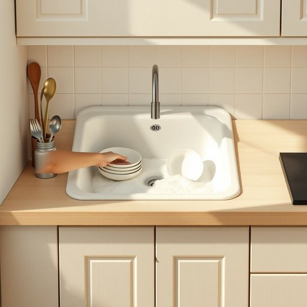

# sink

<h1 style="font-size: 2.5em; font-weight: 300; letter-spacing: 2px; margin: 0; color: #2c3e50;">
/sɪŋk/
</h1>

---

---

## 例句

While washing the stubborn stains off the plates in the kitchen sink, which was already half-filled with soapy water and surrounded by a clutter of drying utensils, she noticed a small leak under the cabinet that, if left unchecked, could cause serious damage to the wooden flooring over time.

*While(/waɪl/) washing(/ˈwɑʃɪŋ/) the(/ðə/) stubborn(/ˈstəbərn/) stains(/steɪnz/) off(/ɔf/) the(/ðə/) plates(/pleɪts/) in(/ɪn/) the(/ðə/) kitchen(/ˈkɪʧən/) sink,(/sɪŋk,/) which(/wɪʧ/) was(/wɑz/) already(/ɔˈrɛdi/) half-filled(/half-filled*/) with(/wɪθ/) soapy(/ˈsoʊpi/) water(/ˈwɔtər/) and(/ənd/) surrounded(/sərˈaʊndɪd/) by(/baɪ/) a(/ə/) clutter(/ˈklətər/) of(/əv/) drying(/draɪɪŋ/) utensils,(/juˈtɛnsəlz,/) she(/ʃi/) noticed(/ˈnoʊtɪst/) a(/ə/) small(/smɔl/) leak(/lik/) under(/ˈəndər/) the(/ðə/) cabinet(/ˈkæbənət/) that,(/ðət,/) if(/ɪf/) left(/lɛft/) unchecked,(/ənˈʧɛkt,/) could(/kʊd/) cause(/kɔz/) serious(/ˈsɪriəs/) damage(/ˈdæmɪʤ/) to(/tɪ/) the(/ðə/) wooden(/ˈwʊdən/) flooring(/ˈflɔrɪŋ/) over(/ˈoʊvər/) time.(/taɪm./)*

**翻译：** 当她在厨房水槽中清洗那些顽固的污渍时，水槽里已经盛着半缸肥皂水，周围摆满了杂乱的晾干餐具，她注意到橱柜下方有一处细微的渗漏，若不及时处理，时间一长可能会对木地板造成严重损害。

---

## 解释

英语单词'sink'作为名词，在家居生活用品的语境中通常指厨房或浴室中的“水槽”或“洗涤槽”，是用来盛水并排出污水的固定装置，常见于厨房准备食物和清洗餐具时使用，或浴室中用来洗手、洗脸。具体使用场合多见于描述家居环境、装修、日常生活和家务劳动，比如“kitchen sink”（厨房水槽）、“bathroom sink”（卫生间洗手池）。学习者使用时需注意，作为可数名词，单复数形式分别为'sink'和'sinks'，且常与介词短语连用，如“in the sink”“under the sink”。常见搭配还包括“drain sink”（排水槽）、“double sink”（双水槽）、“sink faucet”（水槽水龙头），表达中通常与流水、排水相关功能结合。词源上，'sink'源自古英语“sincan”，意为“沉没、下沉”，引申为安装在地面或柜台上，水能流入而排出的装置，反映了物体向下沉降的基本含义。该词在中文语境中最准确的对应是“水槽”或“洗涤槽”，强调其作为固定设施和排水功能的属性，无明显褒贬色彩，属中性词汇，符合日常生活中家居环境的标准表述。在文化层面，此词无特殊隐喻或象征意义，主要实用性强，便于明确描述家具和室内布局中的水处理设施。

---

<small style="color: #999; font-size: 0.9em;">2025-07-17 06:22:40</small>

