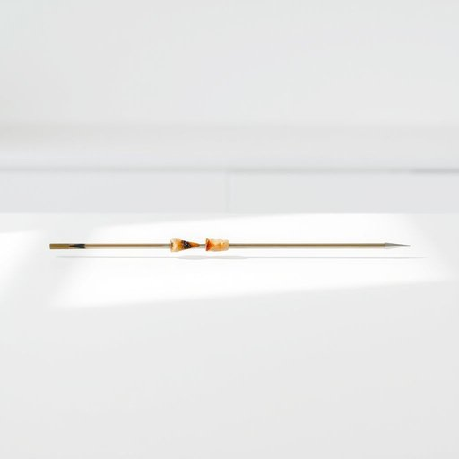

# skewer

<h1 style="font-size: 2.5em; font-weight: 300; letter-spacing: 2px; margin: 0; color: #2c3e50;">
/skjuər/
</h1>

---

---

## 例句

Could you please pass me the skewer that’s been soaking in water on the kitchen counter, the one with the slightly charred tip, so I can thread the marinated vegetables and chunks of chicken carefully before placing them on the grill?

*Could(/kʊd/) you(/ju/) please(/pliz/) pass(/pæs/) me(/mi/) the(/ðə/) skewer(/skjuər/) that’s(/that’s*/) been(/bɪn/) soaking(/ˈsoʊkɪŋ/) in(/ɪn/) water(/ˈwɔtər/) on(/ɔn/) the(/ðə/) kitchen(/ˈkɪʧən/) counter,(/ˈkaʊntər,/) the(/ðə/) one(/wən/) with(/wɪθ/) the(/ðə/) slightly(/sˈlaɪtli/) charred(/ʧɑrd/) tip,(/tɪp,/) so(/soʊ/) I(/aɪ/) can(/kən/) thread(/θrɛd/) the(/ðə/) marinated(/ˈmɛrəˌneɪtɪd/) vegetables(/ˈvɛʤtəbəlz/) and(/ənd/) chunks(/ʧəŋks/) of(/əv/) chicken(/ˈʧɪkən/) carefully(/ˈkɛrfəli/) before(/ˌbiˈfɔr/) placing(/ˈpleɪsɪŋ/) them(/ðɛm/) on(/ɔn/) the(/ðə/) grill?(/grɪl?/)*

**翻译：** 请把厨房台面上那个正在水中浸泡、尖端微微焦黑的签子递给我，好让我在放到烤架上之前，小心地串起腌制好的蔬菜和鸡肉块。

---

## 解释

英语单词“skewer”作为家居生活用品中的名词，指的是一种细长的金属棒或木棒，常用于烹饪时将肉类、蔬菜等串成串状以便烧烤或烘烤，典型使用场合包括烧烤聚会、家庭烹饪或餐厅服务中。英语学习者在使用“skewer”时需要注意其作为可数名词的用法，常见搭配有“metal skewer”（金属烤签）、“wooden skewer”（木质烤签）、“kebab skewer”（烤肉串签）以及动词形式“to skewer”表示“用烤签穿起”的动作，同时“skewer”在复数形式中为“skewers”。语法上，这个词多用作具体物品的名称，句中多作为宾语或主语出现。词源方面，“skewer”来源于中古英语“skewer”或“skewere”，进一步源自古北欧语“skúfa”，意为“推、刺”，反映了其穿刺食物的功能。在中文语境中，“skewer”准确理解为“烤签”或“串签”，强调其作为穿刺食物用的细长器具的实物属性，且没有贬义或特殊褒义色彩，只是一个描述工具的中性词汇，但在某些隐喻或比喻用法中，“to skewer someone”含有“尖锐批评、讽刺”的意思，这在家居生活用品语境中通常不涉及。

---

<small style="color: #999; font-size: 0.9em;">2025-07-17 06:22:40</small>

