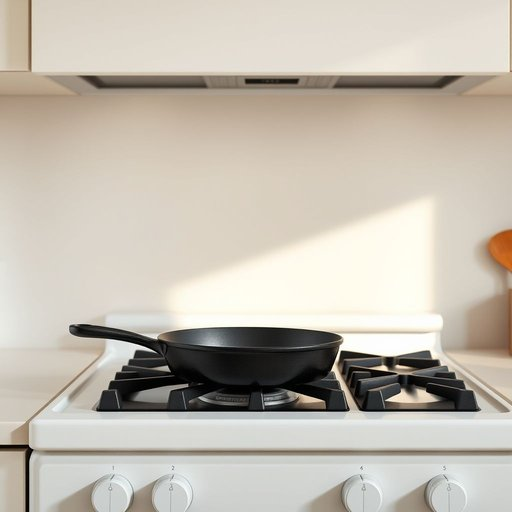

# skillet

<h1 style="font-size: 2.5em; font-weight: 300; letter-spacing: 2px; margin: 0; color: #2c3e50;">
/ˈskɪlət/
</h1>

---

---

## 例句

After unpacking the groceries, she carefully placed the cast-iron skillet on the stove, knowing that its even heat distribution and sturdy handle would be perfect not only for frying the eggs but also for preparing a slow-cooked stew later in the evening.

*After(/ˈæftər/) unpacking(/ənˈpækɪŋ/) the(/ðə/) groceries,(/ˈgroʊsəriz,/) she(/ʃi/) carefully(/ˈkɛrfəli/) placed(/pleɪst/) the(/ðə/) cast-iron(/cast-iron*/) skillet(/ˈskɪlət/) on(/ɔn/) the(/ðə/) stove,(/stoʊv,/) knowing(/noʊɪŋ/) that(/ðət/) its(/ɪts/) even(/ˈivɪn/) heat(/hit/) distribution(/ˌdɪstrəˈbjuʃən/) and(/ənd/) sturdy(/ˈstərdi/) handle(/ˈhændəl/) would(/wʊd/) be(/bi/) perfect(/ˈpərˌfɪkt/) not(/nɑt/) only(/ˈoʊnli/) for(/fər/) frying(/fraɪɪŋ/) the(/ðə/) eggs(/ɛgz/) but(/bət/) also(/ˈɔlsoʊ/) for(/fər/) preparing(/pərˈpɛrɪŋ/) a(/ə/) slow-cooked(/slow-cooked*/) stew(/stu/) later(/ˈleɪtər/) in(/ɪn/) the(/ðə/) evening.(/ˈivnɪŋ./)*

**翻译：** 整理完杂货后，她小心翼翼地将铸铁煎锅放在炉子上，深知它均匀的导热性和坚固的把手不仅非常适合煎蛋，晚上还能用来慢炖一锅美味的炖菜。

---

## 解释

英语单词“skillet”在家居生活用品场景中作为名词，特指一种平底且通常带有较长手柄的煎锅，广泛用于煎、炒、烹调各种食物。具体使用场合通常是在厨房烹饪时，比如做煎蛋、煎肉饼或炒蔬菜时提及这一器具。英语学习者需要注意“skillet”在语法上通常作为可数名词使用，复数形式为“skillets”，常见搭配有“cast iron skillet”（铸铁煎锅）、“non-stick skillet”（不粘煎锅）、“heat a skillet”（加热煎锅）等表达，使用时应注意与动词连用的恰当时态和数量一致。词源方面，“skillet”源自中古英语“skylet”，进一步来源于古法语“escuele”表示小碗或盘，最初指含边的平底器皿，逐渐演变为指代特定的煎锅。中文语境中，“skillet”通常精准翻译为“煎锅”或“平底锅”，强调其用途和形状，区别于其他如炒锅（wok）或平底锅的更宽泛称谓，注意“煎锅”一词在日常生活中没有褒贬色彩，但在不同地区或文化中可能因材质和用途的不同而有轻微差异，此外“skillet”在美式英语中使用较为普遍，英式英语更常用“frying pan”作为类似用具的称谓，了解这一点有助于理解和运用。

---

<small style="color: #999; font-size: 0.9em;">2025-07-17 06:22:40</small>

