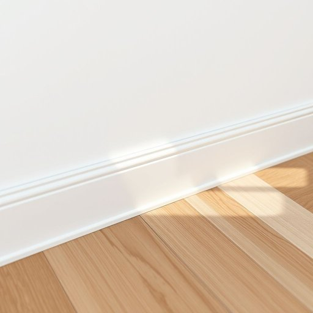

# skirting

<h1 style="font-size: 2.5em; font-weight: 300; letter-spacing: 2px; margin: 0; color: #2c3e50;">
/ˈskərtɪŋ/
</h1>

---

---

## 例句

When we decided to refurbish the living room, my partner insisted that we replace the old, chipped skirting, which had not only accumulated years of dust in its intricate grooves but also clashed with the new décor, so we chose a sleek, white timber skirting board that seamlessly complements both the oak flooring and the minimalist aesthetic we’re aiming for.

*When(/wɪn/) we(/wi/) decided(/ˌdɪˈsaɪdɪd/) to(/tɪ/) refurbish(/riˈfərbɪʃ/) the(/ðə/) living(/ˈlɪvɪŋ/) room,(/rum,/) my(/maɪ/) partner(/ˈpɑrtnər/) insisted(/ˌɪnˈsɪstɪd/) that(/ðət/) we(/wi/) replace(/ˌriˈpleɪs/) the(/ðə/) old,(/oʊld,/) chipped(/ʧɪpt/) skirting,(/ˈskərtɪŋ,/) which(/wɪʧ/) had(/hæd/) not(/nɑt/) only(/ˈoʊnli/) accumulated(/əˈkjumjəˌleɪtɪd/) years(/jɪrz/) of(/əv/) dust(/dəst/) in(/ɪn/) its(/ɪts/) intricate(/ˈɪntrəkət/) grooves(/gruvz/) but(/bət/) also(/ˈɔlsoʊ/) clashed(/klæʃt/) with(/wɪθ/) the(/ðə/) new(/nu/) décor,(/décor*,/) so(/soʊ/) we(/wi/) chose(/ʧoʊz/) a(/ə/) sleek,(/slik,/) white(/waɪt/) timber(/ˈtɪmbər/) skirting(/ˈskərtɪŋ/) board(/bɔrd/) that(/ðət/) seamlessly(/ˈsimləsli/) complements(/ˈkɑmpləmənts/) both(/boʊθ/) the(/ðə/) oak(/oʊk/) flooring(/ˈflɔrɪŋ/) and(/ənd/) the(/ðə/) minimalist(/ˈmɪnəməlɪst/) aesthetic(/ɛsˈθɛtɪk/) we’re(/we’re*/) aiming(/ˈeɪmɪŋ/) for.(/fər./)*

**翻译：** 当我们决定翻新客厅时，我的伴侣坚持要更换那条旧而有缺口的踢脚板。那踢脚板不仅在复杂的凹槽中积累了多年的灰尘，还与全新的装饰风格格格不入。于是我们选择了一条光滑的白色木质踢脚板，它无缝地衬托出橡木地板，同时与我们追求的极简美学完美契合。

---

## 解释

“skirting”作为名词在家居生活用品的英语语境中，通常指的是“踢脚线”或“墙裙”，即安装在墙壁底部与地板接缝处的一条装饰性或保护用的条板。具体使用场合多见于室内装修描述、家具摆放或清洁维护等情境，如“installing skirting boards”（安装踢脚线板）或“clean under the skirting”（清理踢脚线下方的灰尘）。英语学习者在使用该词时应注意，“skirting”在此作为名词常以复数形式出现“skirting boards”或“skirtings”，不过单数形式“skirting”也被接受；此外，需区别“skirting”作为动词的现在分词用法，比如“skirting the issue”（回避问题）与作为名词时的家居含义。常见搭配包括“skirting board”、“paint the skirting”、“wooden skirting”等。词源方面，“skirting”来自动词“skirt”，源自古英语“scyrtan”，意为“环绕”或“边缘”，引申为家居中环绕房间边缘的板条。中文语境中，“skirting”最准确的翻译是“踢脚线”或“墙裙”，这一家具细节不仅具有保护墙角、防止水渍及灰尘滲入墙脚的实用功能，同时也具有一定的装饰美化效果。该词在家居领域是中性词，不带褒贬色彩，属于常用专业术语。理解并正确运用“skirting”有助于提升有关室内设计或家居维护的表达准确性。

---

<small style="color: #999; font-size: 0.9em;">2025-07-17 06:22:40</small>

