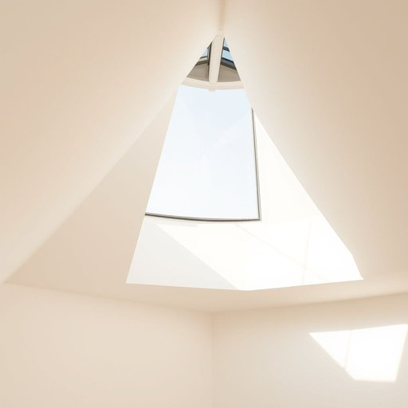

# skylight

<h1 style="font-size: 2.5em; font-weight: 300; letter-spacing: 2px; margin: 0; color: #2c3e50;">
/ˈskaɪˌlaɪt/
</h1>

---

---

## 例句

Although we initially thought that installing a skylight in the loft would be a straightforward way to bring in more natural light, we soon realised that, because of the roof’s steep pitch and the need for proper insulation, it required careful planning and professional fitting to ensure it didn’t cause any drafts or leaks during the rainy British winters.

*Although(/ˌɔlˈðoʊ/) we(/wi/) initially(/ˌɪˈnɪʃəli/) thought(/θɔt/) that(/ðət/) installing(/ˌɪnˈstɔlɪŋ/) a(/ə/) skylight(/ˈskaɪˌlaɪt/) in(/ɪn/) the(/ðə/) loft(/lɔft/) would(/wʊd/) be(/bi/) a(/ə/) straightforward(/ˈstreɪtˈfɔrwərd/) way(/weɪ/) to(/tɪ/) bring(/brɪŋ/) in(/ɪn/) more(/mɔr/) natural(/ˈnæʧərəl/) light,(/laɪt,/) we(/wi/) soon(/sun/) realised(/ˈriəˌlaɪzd/) that,(/ðət,/) because(/bɪˈkəz/) of(/əv/) the(/ðə/) roof’s(/roof’s*/) steep(/stip/) pitch(/pɪʧ/) and(/ənd/) the(/ðə/) need(/nid/) for(/fər/) proper(/ˈprɑpər/) insulation,(/ˌɪnsəˈleɪʃən,/) it(/ɪt/) required(/rikˈwaɪərd/) careful(/ˈkɛrfəl/) planning(/ˈplænɪŋ/) and(/ənd/) professional(/prəˈfɛʃənəl/) fitting(/ˈfɪtɪŋ/) to(/tɪ/) ensure(/ɪnˈʃʊr/) it(/ɪt/) didn’t(/didn’t*/) cause(/kɔz/) any(/ˈɛni/) drafts(/dræfts/) or(/ər/) leaks(/liks/) during(/ˈdʊrɪŋ/) the(/ðə/) rainy(/ˈreɪni/) British(/ˈbrɪtɪʃ/) winters.(/ˈwɪntərz./)*

**翻译：** 虽然我们最初认为在阁楼安装天窗是引入更多自然光的简便方法，但很快我们意识到，由于屋顶陡峭的坡度和对适当隔热的要求，这项工作需要精心规划和专业安装，以确保在多雨的英国冬季不会造成任何漏风或渗水问题。

---

## 解释

英语单词“skylight”作为名词在家居生活用品语境中，通常指的是建筑物屋顶上的天窗，用以引入自然光线，改善室内采光和通风。其具体使用场合包括住宅、办公室或商业建筑中需要额外采光的空间，尤其是顶层或阁楼。英语学习者在使用“skylight”时应注意它是可数名词，常与“install”（安装）、“open”（打开）、“glass”（玻璃）等动词或形容词搭配，如“install a skylight”（安装天窗）、“an open skylight”（打开的天窗）、“a glass skylight”（玻璃天窗）。此外，固定搭配“bring in natural light”也常用来描述天窗的功能。词源上，“sky”来源于古英语意为天空，“light”意为光，二者结合指代来自天空的光线，体现了其设计初衷。中文中，“skylight”准确翻译为“天窗”，强调其在屋顶部分设置以引光的结构，区别于墙面窗。无特殊褒贬色彩，但在文化层面，天窗常象征现代家居设计中追求光线和空间感的理念，因其改善采光和视觉开阔度的作用而被广泛认可和应用。

---

<small style="color: #999; font-size: 0.9em;">2025-07-17 06:22:40</small>

