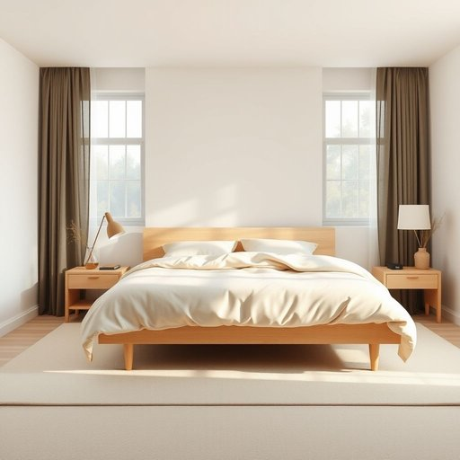

# sleep

<h1 style="font-size: 2.5em; font-weight: 300; letter-spacing: 2px; margin: 0; color: #2c3e50;">
/slip/
</h1>

---

---

## 例句

After the rearrangement of the living room furniture to create a cozier atmosphere and the installation of blackout curtains to block out the early morning light, the achievement of uninterrupted sleep was finally realized, which contributed significantly to the overall feeling of refreshment and energy throughout the day.

*After(/ˈæftər/) the(/ðə/) rearrangement(/riərˈeɪnʤmənt/) of(/əv/) the(/ðə/) living(/ˈlɪvɪŋ/) room(/rum/) furniture(/ˈfərnɪʧər/) to(/tɪ/) create(/kriˈeɪt/) a(/ə/) cozier(/ˈkoʊziər/) atmosphere(/ˈætməsˌfɪr/) and(/ənd/) the(/ðə/) installation(/ˌɪnstəˈleɪʃən/) of(/əv/) blackout(/ˈblæˌkaʊt/) curtains(/ˈkərtənz/) to(/tɪ/) block(/blɑk/) out(/aʊt/) the(/ðə/) early(/ˈərli/) morning(/ˈmɔrnɪŋ/) light,(/laɪt,/) the(/ðə/) achievement(/əˈʧivmənt/) of(/əv/) uninterrupted(/ˌənɪnərˈəptɪd/) sleep(/slip/) was(/wɑz/) finally(/ˈfaɪnəli/) realized,(/ˈriəˌlaɪzd,/) which(/wɪʧ/) contributed(/kənˈtrɪbjutɪd/) significantly(/sɪgˈnɪfɪkəntli/) to(/tɪ/) the(/ðə/) overall(/ˈoʊvərˌɔl/) feeling(/ˈfilɪŋ/) of(/əv/) refreshment(/rəˈfrɛʃmənt/) and(/ənd/) energy(/ˈɛnərʤi/) throughout(/θruaʊt/) the(/ðə/) day.(/deɪ./)*

**翻译：** 经过重新布置客厅家具以营造更温馨的氛围，并安装遮光窗帘以阻挡清晨的光线，终于实现了不间断的睡眠，这大大提升了整天的精神焕发与活力感。

---

## 解释

在家居生活用品的语境中，英语单词'sleep'作为名词主要指“睡眠”这一生理状态，具体使用场合通常涉及描述人们在家具如床铺、床垫、枕头等环境中休息的时间和质量，比如说“a good night’s sleep”（一晚好觉）或“sleep quality”（睡眠质量）。英语学习者使用时需要注意，作为名词的'sleep'是不可以数的（uncountable noun），不能直接用复数形式 appearancesleeps，且常与形容词如deep（深度的）、sound（安稳的）、light（浅的）、fitful（断断续续的）等搭配，此外也常用在固定搭配如“get some sleep”或“fall asleep”（动词短语）中，表达入睡或获得睡眠的动作。词源上，'sleep'源自古英语“slǣp”，与德语“Schlaf”和荷兰语“slaap”同源，均指睡眠状态，反映该词从印欧语系中早期语言起即与休息、闭眼状态相关。中文语境中，'sleep'作为名词通常准确翻译为“睡眠”，强调生理和心理的休息意义，区别于动词“睡觉”，其含义较为中性，无特别褒贬色彩，但在文化上“良好的睡眠”常被视为健康生活的重要标志。总体来看，'sleep'作为名词在家居生活用品中，是评价和讨论家具舒适性、人体健康关联的重要词汇。

---

<small style="color: #999; font-size: 0.9em;">2025-07-17 06:22:40</small>

