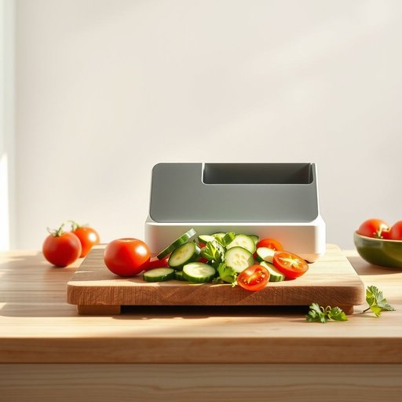

# slicer

<h1 style="font-size: 2.5em; font-weight: 300; letter-spacing: 2px; margin: 0; color: #2c3e50;">
/sˈlaɪsər/
</h1>

---

---

## 例句

Could you please pass me the slicer, the one with the adjustable thickness setting and the safety guard, so that I can prepare some perfectly even slices of cucumber and tomato for the salad before our guests arrive?

*Could(/kʊd/) you(/ju/) please(/pliz/) pass(/pæs/) me(/mi/) the(/ðə/) slicer,(/sˈlaɪsər,/) the(/ðə/) one(/wən/) with(/wɪθ/) the(/ðə/) adjustable(/əˈʤəstəbəl/) thickness(/ˈθɪknəs/) setting(/ˈsɛtɪŋ/) and(/ənd/) the(/ðə/) safety(/ˈseɪfti/) guard,(/gɑrd,/) so(/soʊ/) that(/ðət/) I(/aɪ/) can(/kən/) prepare(/priˈpɛr/) some(/səm/) perfectly(/ˈpərfəktli/) even(/ˈivɪn/) slices(/sˈlaɪsɪz/) of(/əv/) cucumber(/ˈkjukəmbər/) and(/ənd/) tomato(/təˈmɑˌtoʊ/) for(/fər/) the(/ðə/) salad(/ˈsæləd/) before(/ˌbiˈfɔr/) our(/ɑr/) guests(/gɛsts/) arrive?(/əraɪv?/)*

**翻译：** 请您把切片器递给我，就是那个带有可调厚度设置和安全护罩的，这样我就能在客人到来之前，切出均匀完美的黄瓜和西红柿片，准备沙拉。

---

## 解释

英语单词slicer在家居生活用品的语境中通常指用于切片食物的工具或设备，如切片机、切片刀，常见于厨房环境，用来切割面包、蔬菜、肉类等以获得均匀薄片。使用该词时，作为名词，注意其可数形式，复数为slicers，通常与限定词连用，如a slicer或the slicer。常见搭配有kitchen slicer（厨房切片机）、bread slicer（面包切片机）等，英语学习者应注意该词主要指具体的切割工具而非动词的进行时态，避免混淆。词源上，slicer来自于动词slice（切片）的派生名词形式，加上表示执行者或工具的后缀-er，意指切片器。在中文语境中，slicer准确翻译为切片机或切片器，强调工具功能，属于中性词汇，无褒贬色彩，主要反映实用性，文化内涵较为普通，适用于描述厨房或餐饮相关的用具。

---

<small style="color: #999; font-size: 0.9em;">2025-07-17 06:22:40</small>

