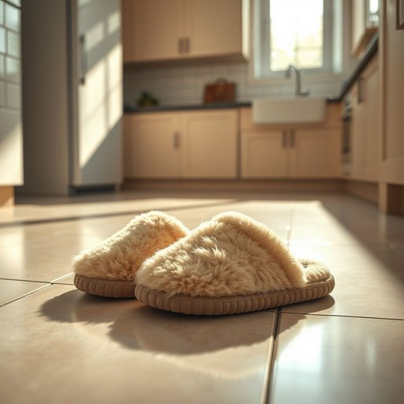

# slipper

<h1 style="font-size: 2.5em; font-weight: 300; letter-spacing: 2px; margin: 0; color: #2c3e50;">
/sˈlɪpər/
</h1>

---

---

## 例句

After a long day at work, when she finally slipped off her heels and walked barefoot across the cold kitchen tiles, she smiled at the sight of her favourite fluffy slipper neatly placed beside the door, which, having been worn nearly every evening for the past year, had become as essential to her evening routine as her cup of tea and the well-worn novel resting on the armchair.

*After(/ˈæftər/) a(/ə/) long(/lɔŋ/) day(/deɪ/) at(/æt/) work,(/wərk,/) when(/wɪn/) she(/ʃi/) finally(/ˈfaɪnəli/) slipped(/slɪpt/) off(/ɔf/) her(/hər/) heels(/hilz/) and(/ənd/) walked(/wɔkt/) barefoot(/ˈbɛrˌfʊt/) across(/əˈkrɔs/) the(/ðə/) cold(/koʊld/) kitchen(/ˈkɪʧən/) tiles,(/taɪlz,/) she(/ʃi/) smiled(/smaɪld/) at(/æt/) the(/ðə/) sight(/saɪt/) of(/əv/) her(/hər/) favourite(/ˈfeɪvərɪt/) fluffy(/ˈfləfi/) slipper(/sˈlɪpər/) neatly(/ˈnitli/) placed(/pleɪst/) beside(/ˌbiˈsaɪd/) the(/ðə/) door,(/dɔr,/) which,(/wɪʧ,/) having(/ˈhævɪŋ/) been(/bɪn/) worn(/wɔrn/) nearly(/ˈnɪrli/) every(/ˈɛvəri/) evening(/ˈivnɪŋ/) for(/fər/) the(/ðə/) past(/pæst/) year,(/jɪr,/) had(/hæd/) become(/bɪˈkəm/) as(/ɛz/) essential(/ɛˈsɛnʃəl/) to(/tɪ/) her(/hər/) evening(/ˈivnɪŋ/) routine(/ruˈtin/) as(/ɛz/) her(/hər/) cup(/kəp/) of(/əv/) tea(/ti/) and(/ənd/) the(/ðə/) well-worn(/well-worn*/) novel(/ˈnɑvəl/) resting(/ˈrɛstɪŋ/) on(/ɔn/) the(/ðə/) armchair.(/ˈɑrmˌʧɛr./)*

**翻译：** 经过漫长的一天工作，她终于脱下高跟鞋，赤脚踩在冰冷的厨房瓷砖上，看到心爱的一双毛绒拖鞋整齐地摆放在门旁，嘴角不由自主地露出笑容。那双拖鞋几乎每天晚上都穿，已成为她晚间日常中必不可少的存在，就像她的那杯茶和安放在扶手椅上的那本翻阅已久的小说一样。

---

## 解释

英语单词“slipper”作为名词，在家居生活用品语境中指的是室内穿着的便鞋，通常质地柔软、轻便，目的是在家中提供舒适和保暖，避免赤脚踩在冰冷或硬质地面上。具体使用场合多为家庭环境，如早晨起床后穿着防滑拖鞋，或晚上放松时使用的毛绒拖鞋。英语学习者应注意“slipper”通常是可数名词，复数形式为“slippers”，多指一双，且常见固定搭配包括“a pair of slippers”（一双拖鞋）、“wear slippers”（穿拖鞋）、“slipper socks”（拖鞋袜，结合袜子和拖鞋的特点）。在表达时，还可用形容词修饰，如“comfortable slippers”（舒适的拖鞋）、“fuzzy slippers”（毛绒拖鞋）。词源上，“slipper”源自古英语“sliper”，意为滑动的东西，反映出拖鞋便于穿脱和脚步轻松滑动的特性。中文中，“slipper”准确翻译为“拖鞋”或“室内拖鞋”，强调其主要功能是在室内穿着，与户外鞋区分开来。在文化层面，“slipper”通常无褒贬含义，体现居家生活的舒适与休闲，不过在某些英语习惯用语中如“to throw the slipper”有象征意义（意指参与决斗），但这与家居用品无关。因此，作为家居用品，“slipper”是一种功能性较强且具舒适感的日常物品，表达时应结合具体语境准确使用。

---

<small style="color: #999; font-size: 0.9em;">2025-07-17 06:22:40</small>

