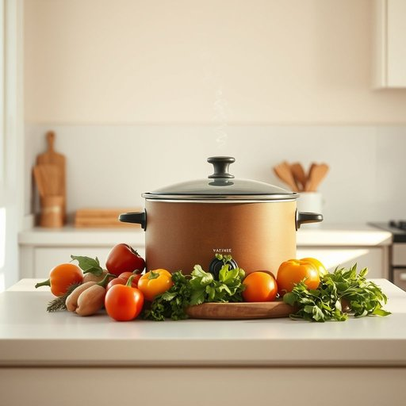

# slow-cooker

<h1 style="font-size: 2.5em; font-weight: 300; letter-spacing: 2px; margin: 0; color: #2c3e50;">
/slow-cooker*/
</h1>

---

---

## 例句

Ever since we bought the slow-cooker last Christmas, which my partner insisted would save us time during busy weeknights, I've found it indispensable for preparing hearty stews and tender roasts that not only fill the house with a comforting aroma but also allow us to enjoy home-cooked meals without spending hours in the kitchen.

*Ever(/ˈɛvər/) since(/sɪns/) we(/wi/) bought(/bɔt/) the(/ðə/) slow-cooker(/slow-cooker*/) last(/læst/) Christmas,(/ˈkrɪsməs,/) which(/wɪʧ/) my(/maɪ/) partner(/ˈpɑrtnər/) insisted(/ˌɪnˈsɪstɪd/) would(/wʊd/) save(/seɪv/) us(/ˈjuˈɛs/) time(/taɪm/) during(/ˈdʊrɪŋ/) busy(/ˈbɪzi/) weeknights,(/weeknights*,/) I've(/aɪv/) found(/faʊnd/) it(/ɪt/) indispensable(/ˌɪndɪˈspɛnsəbəl/) for(/fər/) preparing(/pərˈpɛrɪŋ/) hearty(/ˈhɑrti/) stews(/stuz/) and(/ənd/) tender(/ˈtɛndər/) roasts(/roʊsts/) that(/ðət/) not(/nɑt/) only(/ˈoʊnli/) fill(/fɪl/) the(/ðə/) house(/haʊs/) with(/wɪθ/) a(/ə/) comforting(/ˈkəmfərtɪŋ/) aroma(/ərˈoʊmə/) but(/bət/) also(/ˈɔlsoʊ/) allow(/əˈlaʊ/) us(/ˈjuˈɛs/) to(/tɪ/) enjoy(/ˌɛnˈʤɔɪ/) home-cooked(/home-cooked*/) meals(/milz/) without(/wɪˈθaʊt/) spending(/ˈspɛndɪŋ/) hours(/aʊərz/) in(/ɪn/) the(/ðə/) kitchen.(/ˈkɪʧən./)*

**翻译：** 自从去年圣诞节我们买了慢炖锅后，我的伴侣坚持说这能帮我们在忙碌的平日晚节省时间，而我发现它在烹制丰盛的炖菜和嫩滑的烤肉时不可或缺。不仅让整个房子弥漫着温馨的香气，也让我们无需花费数小时在厨房，就能享受到家常美味。

---

## 解释

“slow-cooker”作为名词，指的是一种家用电器，通常称为“慢炖锅”或“慢煮锅”，用于以较低温度长时间烹饪食物，特别适合炖煮汤、肉类或炖菜等需要缓慢加热以保证口感和入味的菜肴。这种电器常见于家庭厨房，适合忙碌的人士提前准备食材后放入设备中，然后通过低温长时间烹饪，便于使用且能节省时间。英语学习者在使用“slow-cooker”时应注意其作为可数名词，通常可用不定冠词a slow-cooker或复数形式slow-cookers，例如“I bought a slow-cooker to make stews.”，其常见搭配包括“use a slow-cooker”，“a slow-cooker recipe”，“slow-cooker meal”等，表达时也可用作形容词，置于名词前，如“slow-cooker dishes”。词源方面，“slow-cooker”由slow（慢的）和cooker（烹饪器具）组成，直译即“慢速烹饪器”，反映其慢火煮炖的功能特点。中文语境下，“slow-cooker”应准确翻译为“慢炖锅”或“慢煮锅”，突出了其低温长时间烹饪的特性，没有特别的褒贬色彩，但在文化内涵上，它体现了现代生活节奏快而饮食要求多样化的背景，代表了一种方便省时、健康烹饪的厨房电器选择。

---

<small style="color: #999; font-size: 0.9em;">2025-07-17 06:22:40</small>

