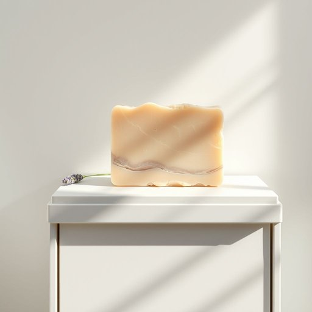

# soap-bar

<h1 style="font-size: 2.5em; font-weight: 300; letter-spacing: 2px; margin: 0; color: #2c3e50;">
/soap-bar*/
</h1>

---

---

## 例句

Could you please check if there’s an extra soap-bar left in the bathroom cabinet, preferably the one infused with lavender and chamomile, because I’ve run out of my usual liquid handwash and the kids are already waiting to wash their hands before dinner?

*Could(/kʊd/) you(/ju/) please(/pliz/) check(/ʧɛk/) if(/ɪf/) there’s(/there’s*/) an(/ən/) extra(/ˈɛkstrə/) soap-bar(/soap-bar*/) left(/lɛft/) in(/ɪn/) the(/ðə/) bathroom(/ˈbæθˌrum/) cabinet,(/ˈkæbənət,/) preferably(/ˈprɛfərəbli/) the(/ðə/) one(/wən/) infused(/ˌɪnfˈjuzd/) with(/wɪθ/) lavender(/ˈlævəndər/) and(/ənd/) chamomile,(/chamomile*,/) because(/bɪˈkəz/) I’ve(/i’ve*/) run(/rən/) out(/aʊt/) of(/əv/) my(/maɪ/) usual(/ˈjuʒəwəl/) liquid(/ˈlɪkwɪd/) handwash(/handwash*/) and(/ənd/) the(/ðə/) kids(/kɪdz/) are(/ər/) already(/ɔˈrɛdi/) waiting(/ˈweɪtɪŋ/) to(/tɪ/) wash(/wɑʃ/) their(/ðɛr/) hands(/hænz/) before(/ˌbiˈfɔr/) dinner?(/ˈdɪnər?/)*

**翻译：** 请帮忙检查浴室柜子里是否还有多余的香皂，最好是含有薰衣草和洋甘菊成分的，因为我用完了平时的洗手液，孩子们已经在等着饭前洗手了。

---

## 解释

“soap-bar”作为名词，指的是固体形态的香皂块，常见于日常家居生活中用于洗手、洗澡或清洁皮肤的场合。使用时多出现在洗浴用品、个人护理或家庭清洁的语境中，比如“一块香皂”是常见表达，英文中通常与数量词“a bar of”连用，注意“bar”是可数名词，单复数形式分别为“bar”与“bars”。学习者需注意不要直接用“soap-bar”作为复数形式，正确形式为“bars of soap”。此外，常见的搭配还包括“plain soap bar”（普通香皂块）、“moisturizing soap bar”（保湿香皂块）等。在语法上，“soap bar”作为名词短语可以作主语或宾语，通常不单独用“bar”指代其他形态的肥皂，且避免与液体“soap”混淆。词源方面，“bar”原意指条状物，结合“soap”形成固定搭配，强调香皂的固体条形外观，这个表达在英语国家已有较长使用历史，反映了传统香皂块的物理形态。“soap-bar”在中文语境中一般译为“香皂”或“肥皂块”，特别指代固体条状形态的肥皂，与液体皂或皂液区别开来，准确理解为生活中最常见的固体洗浴清洁用品。其语言色彩中性，既无褒义也无贬义，属于常见且实用的日常用语，便利表达香皂商品的形式特点，无特殊文化内涵。

---

<small style="color: #999; font-size: 0.9em;">2025-07-17 06:22:40</small>

