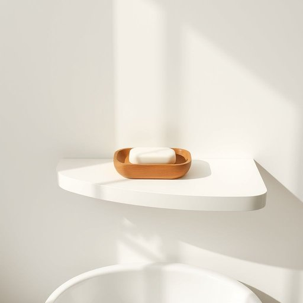

# soap-dish

<h1 style="font-size: 2.5em; font-weight: 300; letter-spacing: 2px; margin: 0; color: #2c3e50;">
/soap-dish*/
</h1>

---

---

## 例句

Could you please move the soap-dish from the edge of the sink to the shelf above, where it won’t get knocked over by the occasional rush of water or clutter from the counter, since it’s been slipping off lately and making a mess?

*Could(/kʊd/) you(/ju/) please(/pliz/) move(/muv/) the(/ðə/) soap-dish(/soap-dish*/) from(/frəm/) the(/ðə/) edge(/ɛʤ/) of(/əv/) the(/ðə/) sink(/sɪŋk/) to(/tɪ/) the(/ðə/) shelf(/ʃɛlf/) above,(/əˈbəv,/) where(/wɛr/) it(/ɪt/) won’t(/won’t*/) get(/gɪt/) knocked(/nɑkt/) over(/ˈoʊvər/) by(/baɪ/) the(/ðə/) occasional(/ɔˈkeɪʒənəl/) rush(/rəʃ/) of(/əv/) water(/ˈwɔtər/) or(/ər/) clutter(/ˈklətər/) from(/frəm/) the(/ðə/) counter,(/ˈkaʊntər,/) since(/sɪns/) it’s(/it’s*/) been(/bɪn/) slipping(/sˈlɪpɪŋ/) off(/ɔf/) lately(/ˈleɪtli/) and(/ənd/) making(/ˈmeɪkɪŋ/) a(/ə/) mess?(/mɛs?/)*

**翻译：** 您能把肥皂盒从水槽边缘挪到上方的搁板上吗？这样它就不会因为偶尔的水流冲击或台面上的杂物而被撞倒，最近它经常滑落，弄得一团糟。

---

## 解释

“soap-dish”作为英语名词，指的是放置肥皂的小盘子或托盘，通常用于浴室或厨房，以防肥皂滑落或融化后弄脏台面，属于家居生活用品的范畴。具体使用场合多见于描述卫生间、洗手台及厨房清洁用品的语境中，常用于日常会话、家居用品购物或室内布置相关的话题中。英语学习者在使用“soap-dish”时需要注意其为复合名词，通常作为单数或复数形式出现，复数为“soap-dishes”，且一般前面可加冠词或数量词，如"a soap-dish"、“two soap-dishes”。常见搭配包括“a ceramic soap-dish”（陶瓷肥皂盒），“a soap-dish holder”（肥皂盘支架）等，表达时可通过形容词修饰材质、颜色、形状等，增强描述的具体性。该词源自于“soap”（肥皂）与“dish”（盘子、碟子）的组合，字面意思即为“放肥皂的盘子”，属直译复合名词，无特殊隐喻或引申含义，起源简单直观。中文语境中，“soap-dish”准确翻译为“肥皂盒”或“肥皂盘”，侧重指承载肥皂的容器，与中文日常用语中“皂盒”、“肥皂托”类似，但一般不含贬义或褒义，属于普通的生活用品名称，使用时应结合具体材质或款式明确指代。总的来看，“soap-dish”是一个实用且常见的家居用品词汇，表达清晰明了，适合各种正式与非正式场合应用。

---

<small style="color: #999; font-size: 0.9em;">2025-07-17 06:22:40</small>

