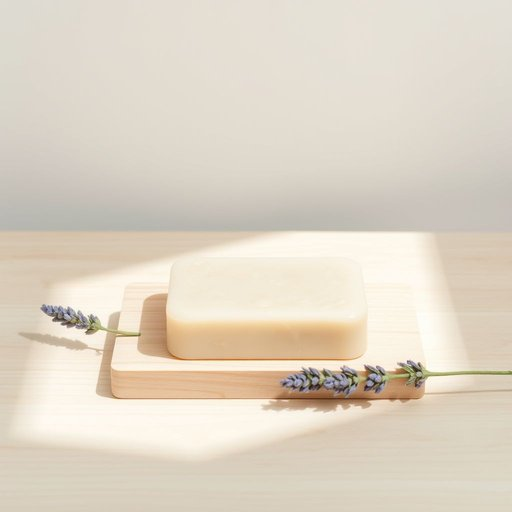

# soap

<h1 style="font-size: 2.5em; font-weight: 300; letter-spacing: 2px; margin: 0; color: #2c3e50;">
/soʊp/
</h1>

---

---

## 例句

Could you please check if we have any lavender-scented soap left in the bathroom cabinet, as the one we usually use has nearly run out, and I want to avoid buying the harsh, synthetic ones that tend to dry out my skin?

*Could(/kʊd/) you(/ju/) please(/pliz/) check(/ʧɛk/) if(/ɪf/) we(/wi/) have(/hæv/) any(/ˈɛni/) lavender-scented(/lavender-scented*/) soap(/soʊp/) left(/lɛft/) in(/ɪn/) the(/ðə/) bathroom(/ˈbæθˌrum/) cabinet,(/ˈkæbənət,/) as(/ɛz/) the(/ðə/) one(/wən/) we(/wi/) usually(/ˈjuʒəwəli/) use(/juz/) has(/həz/) nearly(/ˈnɪrli/) run(/rən/) out,(/aʊt,/) and(/ənd/) I(/aɪ/) want(/wɔnt/) to(/tɪ/) avoid(/əˈvɔɪd/) buying(/baɪɪŋ/) the(/ðə/) harsh,(/hɑrʃ,/) synthetic(/sɪnˈθɛtɪk/) ones(/wənz/) that(/ðət/) tend(/tɛnd/) to(/tɪ/) dry(/draɪ/) out(/aʊt/) my(/maɪ/) skin?(/skɪn?/)*

**翻译：** 请帮我看看浴室柜里是否还有薰衣草香氛的肥皂，因为我们平时用的那块快用完了，我不想买那些刺激且含合成成分、容易让皮肤干燥的肥皂。

---

## 解释

英语单词“soap”作为名词，在家居生活用品的语境中，通常指用于清洁皮肤或洗涤的肥皂，具体使用场合包括浴室洗手、洗澡、清洗衣物或其他日常清洁活动。学习者在使用“soap”时需要注意它通常是不可数名词，但在表示一块肥皂时可用复数形式“soaps”或具体数量词，如“a bar of soap”；常见搭配有“liquid soap”（液体皂）、“soap powder”（洗衣粉，虽不完全等同但相关）、“soap dish”（肥皂托盘）、“soap dispenser”（肥皂分配器）等。此外，“soap”在表述时常与动词“use”（使用）、“apply”（涂抹）、“buy”（购买）等搭配。词源方面，“soap”源自古英语“sāpe”，其更早的起源可能与日耳曼语族相关，指代由动植物油脂与碱反应制成的清洁物质，这一词源反映了肥皂制作的传统工艺和用途。在中文语境中，“soap”准确翻译为“肥皂”，理解时应指代物理形态的清洁制品，无褒贬色彩，属于中性词汇，其主要文化内涵在于日常生活中的卫生和清洁习惯。需要注意的是，在英语中“soap”也有引申含义如“肥皂剧”（soap opera），但在家居生活用品语境下并不适用。

---

<small style="color: #999; font-size: 0.9em;">2025-07-17 06:22:40</small>

