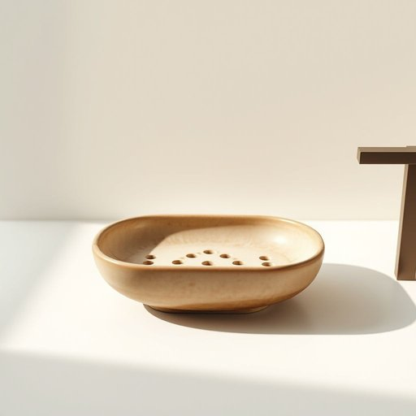

# soapdish

<h1 style="font-size: 2.5em; font-weight: 300; letter-spacing: 2px; margin: 0; color: #2c3e50;">
/soapdish*/
</h1>

---

---

## 例句

After noticing that the soapdish on the bathroom sink was cracked and leaking water onto the counter, she decided to replace it with a more durable ceramic one, which not only matched the overall aesthetic of the room but also had a built-in drainage system to keep the soap dry and prevent any slippery messes.

*After(/ˈæftər/) noticing(/ˈnoʊtɪsɪŋ/) that(/ðət/) the(/ðə/) soapdish(/soapdish*/) on(/ɔn/) the(/ðə/) bathroom(/ˈbæθˌrum/) sink(/sɪŋk/) was(/wɑz/) cracked(/krækt/) and(/ənd/) leaking(/ˈlikɪŋ/) water(/ˈwɔtər/) onto(/ˈɔntu/) the(/ðə/) counter,(/ˈkaʊntər,/) she(/ʃi/) decided(/ˌdɪˈsaɪdɪd/) to(/tɪ/) replace(/ˌriˈpleɪs/) it(/ɪt/) with(/wɪθ/) a(/ə/) more(/mɔr/) durable(/ˈdʊrəbəl/) ceramic(/sərˈæmɪk/) one,(/wən,/) which(/wɪʧ/) not(/nɑt/) only(/ˈoʊnli/) matched(/mæʧt/) the(/ðə/) overall(/ˈoʊvərˌɔl/) aesthetic(/ɛsˈθɛtɪk/) of(/əv/) the(/ðə/) room(/rum/) but(/bət/) also(/ˈɔlsoʊ/) had(/hæd/) a(/ə/) built-in(/ˈbɪlˌtɪn/) drainage(/ˈdreɪnɪʤ/) system(/ˈsɪstəm/) to(/tɪ/) keep(/kip/) the(/ðə/) soap(/soʊp/) dry(/draɪ/) and(/ənd/) prevent(/prɪˈvɛnt/) any(/ˈɛni/) slippery(/sˈlɪpəri/) messes.(/ˈmɛsɪz./)*

**翻译：** 注意到洗手池上的肥皂盒破裂导致水渗漏到台面上后，她决定换一个更耐用的陶瓷肥皂盒，不仅与整个房间的风格相协调，还内置排水系统，能够保持肥皂干燥，避免滑腻的混乱。

---

## 解释

英语单词“soapdish”作为名词，指的是用来放置肥皂的小盘子或皂盒，通常放置在浴室或洗手池附近，避免肥皂因接触水面而溶解或变得湿软。在家居生活用品的语境中，它具体出现于讨论浴室布置、洗手间整理或个人清洁用品时，比如“Please put the wet soap back on the soapdish to dry”（请把湿肥皂放回皂盒晾干）。英语学习者在使用“soapdish”时需注意其复合结构，通常作可数名词使用，可以搭配形容词如“plastic soapdish”（塑料皂盒）、“ceramic soapdish”（陶瓷皂盒），且多用单数或复数形式“soapdishes”。语法上，“soapdish”常作为宾语或主语出现，且拼写通常合成一词，也可见作“soap dish”二词形式，但连写更为常见。词源上，“soapdish”由“soap”（肥皂）和“dish”（盘子）复合而成，直观描述其功能和形态，起源于日常生活对肥皂存放需求的具体物件。中文语境中，该词准确译为“皂盒”或“肥皂盒”，体现其专门盛放肥皂的实用工具性质，没有褒贬含义，属于中性词汇，纯粹描述家居生活中常见的实用物品。该词无明显特殊文化内涵或隐喻，仅作为生活用品名称出现。

---

<small style="color: #999; font-size: 0.9em;">2025-07-17 06:22:40</small>

