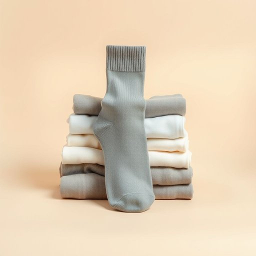

# sock

<h1 style="font-size: 2.5em; font-weight: 300; letter-spacing: 2px; margin: 0; color: #2c3e50;">
/sɑk/
</h1>

---

---

## 例句

Could you please check if the washing machine spun all the socks properly this time, especially the grey one with the hole near the toe, because if it went missing again, I’ll have to dig through the whole laundry pile to find its match?

*Could(/kʊd/) you(/ju/) please(/pliz/) check(/ʧɛk/) if(/ɪf/) the(/ðə/) washing(/ˈwɑʃɪŋ/) machine(/məˈʃin/) spun(/spən/) all(/ɔl/) the(/ðə/) socks(/sɑks/) properly(/ˈprɑpərli/) this(/ðɪs/) time,(/taɪm,/) especially(/əˈspɛʃəli/) the(/ðə/) grey(/greɪ/) one(/wən/) with(/wɪθ/) the(/ðə/) hole(/hoʊl/) near(/nɪr/) the(/ðə/) toe,(/toʊ,/) because(/bɪˈkəz/) if(/ɪf/) it(/ɪt/) went(/wɛnt/) missing(/ˈmɪsɪŋ/) again,(/əˈgɛn,/) I’ll(/i’ll*/) have(/hæv/) to(/tɪ/) dig(/dɪg/) through(/θru/) the(/ðə/) whole(/hoʊl/) laundry(/ˈlɔndri/) pile(/paɪl/) to(/tɪ/) find(/faɪnd/) its(/ɪts/) match?(/mæʧ?/)*

**翻译：** 请你帮忙确认这次洗衣机是否把所有的袜子都甩干了，尤其是那只脚趾处有洞的灰色袜子，因为如果它又不见了，我可得翻遍整堆洗好的衣服才能找到它的另一只。

---

## 解释

英语单词sock作为名词，在家居生活用品的语境中指的是套在脚上的棉织或混纺织物制品，通常用于保护脚部、保持温暖或吸汗，常见于日常穿着和室内生活场合。使用时，英语学习者应注意sock通常是可数名词，单数形式为sock，复数为socks，常见搭配有pair of socks（一双袜子）、cotton socks（棉袜）、wool socks（毛袜）等，且sock一般跟具体的温度、用途或材质词连用，表达特定性质时更准确；此外，sock前可加冠词或所有格，如my socks，the socks。从词源上看，sock源自古英语socc，意为轻便的鞋子或短袜，最初指的是古代穿于脚下的轻便鞋类，后来逐渐演变为现代含袜子的意思。在中文语境中，sock准确译为“袜子”，通常特指短袜或普通家用袜，区别于较长的长筒袜等，理解上侧重于日常穿着舒适和保护作用。需要注意的是，sock在英语中有时在口语和俚语中也用作动词，表示猛击、重击，但作为名词时仅指袜子，没有褒贬色彩或特殊文化内涵，属于中性常用词汇。

---

<small style="color: #999; font-size: 0.9em;">2025-07-17 06:22:40</small>

