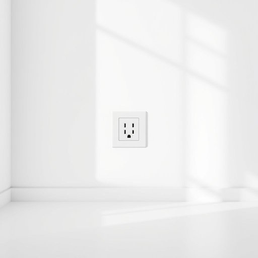

# sockets

<h1 style="font-size: 2.5em; font-weight: 300; letter-spacing: 2px; margin: 0; color: #2c3e50;">
/ˈsɑkəts/
</h1>

---

---

## 例句

Before plugging in the new lamp, could you check if the sockets in the living room, which tend to be a bit unreliable when overloaded with multiple devices like the TV and sound system, are still functioning properly without any loose connections?

*Before(/ˌbiˈfɔr/) plugging(/ˈpləgɪŋ/) in(/ɪn/) the(/ðə/) new(/nu/) lamp,(/læmp,/) could(/kʊd/) you(/ju/) check(/ʧɛk/) if(/ɪf/) the(/ðə/) sockets(/ˈsɑkəts/) in(/ɪn/) the(/ðə/) living(/ˈlɪvɪŋ/) room,(/rum,/) which(/wɪʧ/) tend(/tɛnd/) to(/tɪ/) be(/bi/) a(/ə/) bit(/bɪt/) unreliable(/ˌənrɪˈlaɪəbəl/) when(/wɪn/) overloaded(/ˈoʊvərˌloʊdɪd/) with(/wɪθ/) multiple(/ˈməltəpəl/) devices(/dɪˈvaɪsɪz/) like(/laɪk/) the(/ðə/) TV(/ˌtɛləˈvɪʒən/) and(/ənd/) sound(/saʊnd/) system,(/ˈsɪstəm,/) are(/ər/) still(/stɪl/) functioning(/ˈfəŋkʃənɪŋ/) properly(/ˈprɑpərli/) without(/wɪˈθaʊt/) any(/ˈɛni/) loose(/lus/) connections?(/kəˈnɛkʃənz?/)*

**翻译：** 在插入新灯之前，您能否检查一下客厅的插座是否仍然正常工作？这些插座在同时连接电视和音响等多台设备时，往往会显得有些不稳，有无松动的情况。

---

## 解释

英语单词'sockets'作为名词，在家居生活用品场景中主要指电源插座，即墙上安装用于插入电器插头以供电的装置，常见于家庭、办公室或公共场所的电气设备中。具体使用场合通常是谈论家用电器接入电源的情境，例如“Please plug the lamp into the socket”（请把灯插入插座），这时'socket'指的就是电源插座。英语学习者在使用该单词时需注意其复数形式'sockets'用于表示多个插座，且该词通常作为可数名词出现；常见的搭配有“power socket”（电源插座）、“socket outlet”（插座口）和“electric socket”（电气插座），表达时需区分与“plug”（插头）之间的关系，插头插入插座，二者是配套使用的物品；此外，socket在其它语境中还可指“插槽”、“插孔”，但在家居电器领域主要指电源插座。词源方面，socket源自中古英语“socket”，原意为“插孔、套筒”，其字根来自古法语“soquet”，意指“短袜、小套”，比喻为“套入、嵌入”的部分，后来延伸到技术含义，指可插入装置的凹槽或孔洞。中文语境中，“socket”准确翻译为“插座”或“电源插座”，是家居电气安全和便利的重要组成部分，需区别于“插头”等其他电器配件。该词在家居电器语境无褒贬色彩，属中性词汇，因现代生活电气化普及，在日常交流中使用频率较高，理解和掌握其具体指代对于准确描述家居用电环境至关重要。

---

<small style="color: #999; font-size: 0.9em;">2025-07-17 06:22:40</small>

