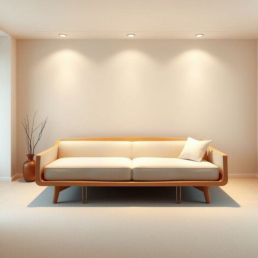

# sofa-bed

<h1 style="font-size: 2.5em; font-weight: 300; letter-spacing: 2px; margin: 0; color: #2c3e50;">
/sofa-bed*/
</h1>

---

---

## 例句

After we discussed how cramped the living room felt with the old armchair and the bulky coffee table, Mary suggested replacing the armchair with a sleek sofa-bed, which not only would provide additional seating during the day but also conveniently transform into a comfortable bed for guests staying overnight, thereby maximizing the limited space without sacrificing style or function.

*After(/ˈæftər/) we(/wi/) discussed(/dɪˈskəst/) how(/haʊ/) cramped(/kræmpt/) the(/ðə/) living(/ˈlɪvɪŋ/) room(/rum/) felt(/fɛlt/) with(/wɪθ/) the(/ðə/) old(/oʊld/) armchair(/ˈɑrmˌʧɛr/) and(/ənd/) the(/ðə/) bulky(/ˈbəlki/) coffee(/ˈkɔfi/) table,(/ˈteɪbəl,/) Mary(/ˈmɛri/) suggested(/səˈʤɛstɪd/) replacing(/rɪˈpleɪsɪŋ/) the(/ðə/) armchair(/ˈɑrmˌʧɛr/) with(/wɪθ/) a(/ə/) sleek(/slik/) sofa-bed,(/sofa-bed*,/) which(/wɪʧ/) not(/nɑt/) only(/ˈoʊnli/) would(/wʊd/) provide(/prəˈvaɪd/) additional(/əˈdɪʃənəl/) seating(/ˈsitɪŋ/) during(/ˈdʊrɪŋ/) the(/ðə/) day(/deɪ/) but(/bət/) also(/ˈɔlsoʊ/) conveniently(/kənˈvinjəntli/) transform(/ˈtrænsfɔrm/) into(/ˈɪntu/) a(/ə/) comfortable(/ˈkəmfərtəbəl/) bed(/bɛd/) for(/fər/) guests(/gɛsts/) staying(/steɪɪŋ/) overnight,(/ˈoʊvərˈnaɪt,/) thereby(/ˈðɛrˈbaɪ/) maximizing(/ˈmæksəˌmaɪzɪŋ/) the(/ðə/) limited(/ˈlɪmɪtɪd/) space(/speɪs/) without(/wɪˈθaʊt/) sacrificing(/ˈsækrəˌfaɪsɪŋ/) style(/staɪl/) or(/ər/) function.(/ˈfəŋkʃən./)*

**翻译：** 在我们讨论了旧扶手椅和笨重咖啡桌让客厅显得狭窄之后，玛丽建议用一张造型简洁的沙发床替换扶手椅，这不仅能在白天提供额外的座位，还能方便地转换成舒适的床铺，供留宿的客人使用，从而在不牺牲风格和功能的前提下，最大化有限的空间。

---

## 解释

英语单词“sofa-bed”作为名词，指的是一种兼具沙发和床两种功能的家具，通常用于客厅或卧室，适合有限空间的家庭或临时住宿需求，如客人留宿时使用。使用时，往往在描述家居布置、家具选择或空间利用的语境中出现，例如“a sofa-bed in the living room”（客厅里的沙发床）。语法上，“sofa-bed”是复合名词，通常作单数使用，复数形式为“sofa-beds”，其前一般可搭配冠词、数量词或形容词，如“a comfortable sofa-bed”或“two sofa-beds”，注意该词为可数名词。英语学习者在使用时应避免将“sofa”与“bed”分开使用，以免改变含义或造成表达混淆。另外，表达时常见搭配还有“pull out sofa-bed”（可以拉出的沙发床）或“convertible sofa-bed”（可转换沙发床），体现其多功能性。词源方面，“sofa-bed”源自“sofa”（指软垫长椅或沙发）和“bed”（床）两个单词的简单组合，体现了家具的双重功能；此类家具在20世纪中叶随都市生活空间紧张而开始普及，尤其在英语国家的租赁公寓和家庭中广受欢迎。在中文语境中，“sofa-bed”准确翻译为“沙发床”，含义明确且无褒贬色彩，是指既可作沙发又可展开成床使用的家具，强调其节省空间和实用性，不涉及特殊文化内涵，使用时应根据实际功能和场合区别对待，避免误解为仅指沙发或普通床。

---

<small style="color: #999; font-size: 0.9em;">2025-07-17 06:22:40</small>

