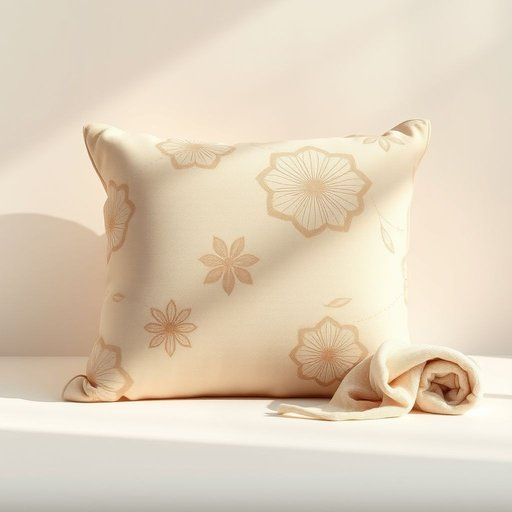

# sofa-cushion

<h1 style="font-size: 2.5em; font-weight: 300; letter-spacing: 2px; margin: 0; color: #2c3e50;">
/sofa-cushion*/
</h1>

---

---

## 例句

When I accidentally spilled my tea on the sofa-cushion, which was not only covered in a delicate floral fabric but also stuffed with memory foam for extra comfort, I immediately grabbed a damp cloth and some upholstery cleaner from the cabinet, hoping to prevent any permanent stains or unpleasant odours from setting in.

*When(/wɪn/) I(/aɪ/) accidentally(/ˌæksəˈdɛnəli/) spilled(/spɪld/) my(/maɪ/) tea(/ti/) on(/ɔn/) the(/ðə/) sofa-cushion,(/sofa-cushion*,/) which(/wɪʧ/) was(/wɑz/) not(/nɑt/) only(/ˈoʊnli/) covered(/ˈkəvərd/) in(/ɪn/) a(/ə/) delicate(/ˈdɛləkət/) floral(/ˈflɔrəl/) fabric(/ˈfæbrɪk/) but(/bət/) also(/ˈɔlsoʊ/) stuffed(/stəft/) with(/wɪθ/) memory(/ˈmɛməri/) foam(/foʊm/) for(/fər/) extra(/ˈɛkstrə/) comfort,(/ˈkəmfərt,/) I(/aɪ/) immediately(/ˌɪˈmiˌdiətli/) grabbed(/græbd/) a(/ə/) damp(/dæmp/) cloth(/klɔθ/) and(/ənd/) some(/səm/) upholstery(/əˈpoʊlstəri/) cleaner(/ˈklinər/) from(/frəm/) the(/ðə/) cabinet,(/ˈkæbənət,/) hoping(/ˈhoʊpɪŋ/) to(/tɪ/) prevent(/prɪˈvɛnt/) any(/ˈɛni/) permanent(/ˈpərmɑˌnɛnt/) stains(/steɪnz/) or(/ər/) unpleasant(/ənˈplɛzənt/) odours(/ˈoʊdərs/) from(/frəm/) setting(/ˈsɛtɪŋ/) in.(/ɪn./)*

**翻译：** 当我不小心把茶水洒在沙发垫上时，那垫子不仅覆盖着精致的花卉布料，还填充了记忆泡沫以增加舒适感，我立刻从柜子里拿出一块湿布和一些家具清洁剂，希望能防止留下永久的污渍或难闻的气味。

---

## 解释

“sofa-cushion”作为名词，指的是沙发上的软垫，主要用于提供坐卧时的舒适感，通常放置在沙发的座面或靠背处。在家居生活用品的语境中，使用“sofa-cushion”时，多出现在描述家居布置、家具维修、更换或装饰时，例如“replace the sofa-cushion”（更换沙发垫）或“the sofa-cushion is too soft”（沙发垫太软）。英语学习者应注意该词为复合名词，通常以连字符连接，作单数或复数使用时在复数部分加“s”（如sofa-cushions），用法上与其他名词一致，可作主语、宾语或定语。此外，常见搭配包括“plump a sofa-cushion”（拍打沙发垫使其蓬松）、“remove the sofa-cushion”（拆下沙发垫）、“sofa-cushion cover”（沙发垫套）等。该词源自“sofa”（意为长椅或沙发，起源于阿拉伯语“ṣuffah”，意为长座位）和“cushion”（意为垫子，源自中古英语，借自古法语“coissin”，最初指软垫或抱枕），两词结合形象地描述了专用于沙发的软质填充物。在中文语境中，“sofa-cushion”准确翻译为“沙发垫”或“沙发坐垫”，强调其作为沙发配套软垫的功能，不带有任何褒贬色彩，也无特殊文化内涵，仅作为家居日常用品的一部分出现，表述中需注意区分“沙发垫”（主要指座垫）与“靠垫”或“抱枕”（cushions或throw pillows），后者更侧重装饰用途，而“sofa-cushion”则偏向于提供坐卧支撑的实用垫子。

---

<small style="color: #999; font-size: 0.9em;">2025-07-17 06:22:40</small>

