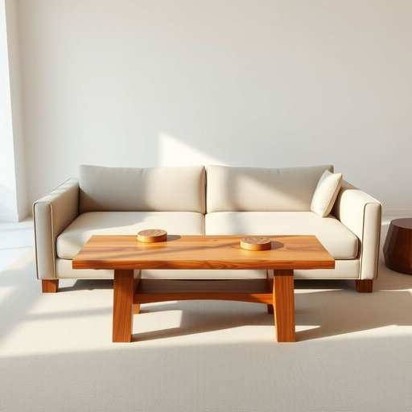

# sofa-table

<h1 style="font-size: 2.5em; font-weight: 300; letter-spacing: 2px; margin: 0; color: #2c3e50;">
/sofa-table*/
</h1>

---

---

## 例句

After rearranging the living room to create a more open and inviting space, she decided that the old sofa-table, which had been doubling as both a coffee table and a makeshift desk cluttered with magazines and remote controls, needed to be replaced with a sturdier, more aesthetically pleasing piece that could better accommodate guests’ drinks and display her growing collection of artisanal coasters.

*After(/ˈæftər/) rearranging(/ˌriərˈeɪnʤɪŋ/) the(/ðə/) living(/ˈlɪvɪŋ/) room(/rum/) to(/tɪ/) create(/kriˈeɪt/) a(/ə/) more(/mɔr/) open(/ˈoʊpən/) and(/ənd/) inviting(/ˌɪnˈvaɪtɪŋ/) space,(/speɪs,/) she(/ʃi/) decided(/ˌdɪˈsaɪdɪd/) that(/ðət/) the(/ðə/) old(/oʊld/) sofa-table,(/sofa-table*,/) which(/wɪʧ/) had(/hæd/) been(/bɪn/) doubling(/ˈdəbəlɪŋ/) as(/ɛz/) both(/boʊθ/) a(/ə/) coffee(/ˈkɔfi/) table(/ˈteɪbəl/) and(/ənd/) a(/ə/) makeshift(/ˈmeɪkˌʃɪft/) desk(/dɛsk/) cluttered(/ˈklətərd/) with(/wɪθ/) magazines(/ˈmægəˌzinz/) and(/ənd/) remote(/rɪˈmoʊt/) controls,(/kənˈtroʊlz,/) needed(/ˈnidɪd/) to(/tɪ/) be(/bi/) replaced(/ˌriˈpleɪst/) with(/wɪθ/) a(/ə/) sturdier,(/ˈstərdiər,/) more(/mɔr/) aesthetically(/ɛsˈθɛtɪkli/) pleasing(/ˈplizɪŋ/) piece(/pis/) that(/ðət/) could(/kʊd/) better(/ˈbɛtər/) accommodate(/əˈkɑməˌdeɪt/) guests’(/guests’*’/) drinks(/drɪŋks/) and(/ənd/) display(/dɪˈspleɪ/) her(/hər/) growing(/groʊɪŋ/) collection(/kəˈlɛkʃən/) of(/əv/) artisanal(/artisanal*/) coasters.(/ˈkoʊstərz./)*

**翻译：** 在重新布置客厅以营造一个更加宽敞且温馨的空间后，她决定更换那张既做咖啡桌又临时当作书桌、堆满杂志和遥控器的旧沙发桌，换成一件结构更坚固、外观更美观的家具，既能更好地容纳来访客人的饮品，也能展示她日益丰富的手工杯垫收藏。

---

## 解释

sofa-table作为名词，指的是一种通常放置在沙发背后或附近的窄长桌子，用于摆放灯具、装饰品或放置饮料等家居物品，主要出现在客厅或休息区的布置场合。英语学习者在使用sofa-table时需注意它是复合名词，前半部分sofa修饰后半部分table，整体指特定类型的桌子，通常用单数或复数形式sofa-tables，且不可与普通桌子table混淆。此外，该词常与形容词连用，如wooden sofa-table木制沙发桌、narrow sofa-table窄长沙发桌等。词源上，sofa-table结合了日常家具sofa沙发与table桌子，源于18世纪至19世纪欧洲家具设计的演变，旨在增添实用性与美观，特别适合沙发布置的辅助家具。中文中的沙发桌或沙发背桌是其准确翻译，强调了其与沙发位置的关系及功能，通常在家居生活用品领域出现，语义中性，无特殊褒贬色彩，也没有特殊文化内涵，主要体现实用与装饰的双重功能。

---

<small style="color: #999; font-size: 0.9em;">2025-07-17 06:22:40</small>

