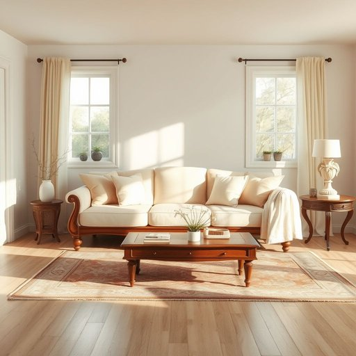

# sofa

<h1 style="font-size: 2.5em; font-weight: 300; letter-spacing: 2px; margin: 0; color: #2c3e50;">
/ˈsoʊfə/
</h1>

---

---

## 例句

After we finished rearranging the living room to let in more natural light and create a cozy atmosphere for guests, I noticed that the new sofa, which combines both comfort and style with its plush cushions and sturdy wooden frame, perfectly complements the vintage rug and antique coffee table we've had for years.

*After(/ˈæftər/) we(/wi/) finished(/ˈfɪnɪʃt/) rearranging(/ˌriərˈeɪnʤɪŋ/) the(/ðə/) living(/ˈlɪvɪŋ/) room(/rum/) to(/tɪ/) let(/lɛt/) in(/ɪn/) more(/mɔr/) natural(/ˈnæʧərəl/) light(/laɪt/) and(/ənd/) create(/kriˈeɪt/) a(/ə/) cozy(/ˈkoʊzi/) atmosphere(/ˈætməsˌfɪr/) for(/fər/) guests,(/gɛsts,/) I(/aɪ/) noticed(/ˈnoʊtɪst/) that(/ðət/) the(/ðə/) new(/nu/) sofa,(/ˈsoʊfə,/) which(/wɪʧ/) combines(/kəmˈbaɪnz/) both(/boʊθ/) comfort(/ˈkəmfərt/) and(/ənd/) style(/staɪl/) with(/wɪθ/) its(/ɪts/) plush(/pləʃ/) cushions(/ˈkʊʃənz/) and(/ənd/) sturdy(/ˈstərdi/) wooden(/ˈwʊdən/) frame,(/freɪm,/) perfectly(/ˈpərfəktli/) complements(/ˈkɑmpləmənts/) the(/ðə/) vintage(/ˈvɪntɪʤ/) rug(/rəg/) and(/ənd/) antique(/ænˈtik/) coffee(/ˈkɔfi/) table(/ˈteɪbəl/) we've(/wiv/) had(/hæd/) for(/fər/) years.(/jɪrz./)*

**翻译：** 在我们重新布置客厅，让更多自然光进入并营造出宾至如归的温馨氛围后，我注意到这款新沙发以其柔软的坐垫和坚固的木质框架，将舒适与风格完美结合，恰好与我们多年来珍藏的复古地毯和古董茶几相得益彰。

---

## 解释

英语单词“sofa”作为名词，指的是一种家居生活用品，通常是一种具有软垫的长凳或沙发，用于多人坐卧，常见于客厅、休息区等场所，主要用于休息、社交或观看电视等活动。“sofa”一般用于描述家具时，语法上为可数名词，复数形式为“sofas”，英语学习者需要注意其单复数变化，同时常见搭配有“comfortable sofa”（舒适的沙发）、“leather sofa”（皮沙发）、“sofa set”（沙发套装）等，表达时可用形容词修饰以描述其材质、风格或舒适度等。词源上，“sofa”一词源自阿拉伯语“ṣuffa”，意指有垫子的长凳，随后通过土耳其语传入欧洲，反映了其最初作为简易长椅的功能，后来演变为现代的软垫沙发。在中文语境中，“sofa”准确翻译为“沙发”，这是一种带有软垫、可供多人坐卧的家具，区别于单人椅（armchair）或凳子（stool），一般无贬义，属于中性词汇，常见于家庭、办公室、公共休息区等环境，体现舒适和休闲的文化内涵。总之，“sofa”在家居生活中是指带软垫的多人座位家具，使用时需注意其数与搭配，理解其文化和词源背景有助于更准确地掌握和使用该词。

---

<small style="color: #999; font-size: 0.9em;">2025-07-17 06:22:40</small>

