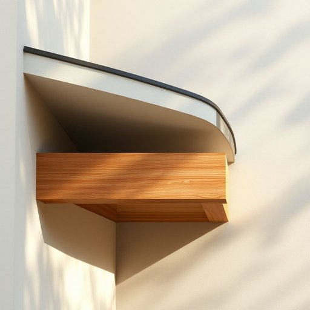

# soffit

<h1 style="font-size: 2.5em; font-weight: 300; letter-spacing: 2px; margin: 0; color: #2c3e50;">
/ˈsɔfɪt/
</h1>

---

---

## 例句

When the soffit, a critical architectural element that conceals structural components and facilitates airflow, was damaged during the storm, the restoration team had to coordinate with multiple specialists to ensure both aesthetic harmony and functional integrity were maintained throughout the entire building.

*When(/wɪn/) the(/ðə/) soffit,(/ˈsɔfɪt,/) a(/ə/) critical(/ˈkrɪtɪkəl/) architectural(/ˌɑrkəˈtɛkʧərəl/) element(/ˈɛləmənt/) that(/ðət/) conceals(/kənˈsilz/) structural(/ˈstrəkʧərəl/) components(/kəmˈpoʊnənts/) and(/ənd/) facilitates(/fəˈsɪləˌteɪts/) airflow,(/ˈɛrfloʊ,/) was(/wɑz/) damaged(/ˈdæmɪʤd/) during(/ˈdʊrɪŋ/) the(/ðə/) storm,(/stɔrm,/) the(/ðə/) restoration(/ˌrɛstərˈeɪʃən/) team(/tim/) had(/hæd/) to(/tɪ/) coordinate(/koʊˈɔrdəˌneɪt/) with(/wɪθ/) multiple(/ˈməltəpəl/) specialists(/ˈspɛʃəlɪsts/) to(/tɪ/) ensure(/ɪnˈʃʊr/) both(/boʊθ/) aesthetic(/ɛsˈθɛtɪk/) harmony(/ˈhɑrməni/) and(/ənd/) functional(/ˈfəŋkʃənəl/) integrity(/ˌɪnˈtɛgrəti/) were(/wər/) maintained(/meɪnˈteɪnd/) throughout(/θruaʊt/) the(/ðə/) entire(/ɪnˈtaɪər/) building.(/ˈbɪldɪŋ./)*

**翻译：** 当天花板檐口这一重要的建筑构件在风暴中受损时，修复团队不得不与多位专家协作，确保整个建筑在保持美学协调的同时，也能维持其功能完整性。

---

## 解释

英语单词“soffit”作为名词，在家居生活用品的语境中主要指的是建筑结构中突出部分的下侧表面，通常是屋檐下方、檐口与建筑立面之间的水平或斜面的封闭面，具体使用场合多见于描述房屋外部建筑细节，例如屋檐下的通风口或装饰板，用以遮盖屋檐的底部结构，防止鸟兽进入或保护木结构不受风雨侵蚀，英语学习者在使用“soffit”时需注意它一般用于单数或复数形式“soffits”，并且多作为可数名词出现，常见搭配包括“install soffit”（安装檐口板）、“ventilated soffit”（通风檐口板）等，语法上，“soffit”通常作为主语或宾语出现，且与建筑、装修相关的动词搭配较多，该词源自拉丁语“suffigere”，意为“固定在下面”，通过法语“soffite”进入英语，反映其建筑结构中“下垂或下方覆盖”的功能，在中文语境中，“soffit”准确翻译为“檐口板”或“檐底板”，强调其作为建筑檐部下方的封闭装饰部分，没有褒贬色彩，属于中性技术性术语，主要用于建筑装潢和维修领域，了解其结构和功能有助于更准确地理解和描述房屋的细节设计。

---

<small style="color: #999; font-size: 0.9em;">2025-07-17 06:22:40</small>

