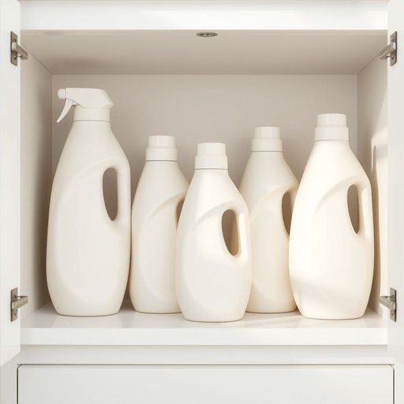

# softener

<h1 style="font-size: 2.5em; font-weight: 300; letter-spacing: 2px; margin: 0; color: #2c3e50;">
/ˈsɔfənər/
</h1>

---

---

## 例句

Could you please check if we have run out of fabric softener in the laundry cupboard, because the clothes came out feeling quite rough today and I suspect the softener, which usually keeps them smelling fresh and feeling soft, wasn’t added during the last wash cycle?

*Could(/kʊd/) you(/ju/) please(/pliz/) check(/ʧɛk/) if(/ɪf/) we(/wi/) have(/hæv/) run(/rən/) out(/aʊt/) of(/əv/) fabric(/ˈfæbrɪk/) softener(/ˈsɔfənər/) in(/ɪn/) the(/ðə/) laundry(/ˈlɔndri/) cupboard,(/ˈkəbərd,/) because(/bɪˈkəz/) the(/ðə/) clothes(/kloʊðz/) came(/keɪm/) out(/aʊt/) feeling(/ˈfilɪŋ/) quite(/kwaɪt/) rough(/rəf/) today(/təˈdeɪ/) and(/ənd/) I(/aɪ/) suspect(/ˈsəˌspɛkt/) the(/ðə/) softener,(/ˈsɔfənər,/) which(/wɪʧ/) usually(/ˈjuʒəwəli/) keeps(/kips/) them(/ðɛm/) smelling(/sˈmɛlɪŋ/) fresh(/frɛʃ/) and(/ənd/) feeling(/ˈfilɪŋ/) soft,(/sɔft,/) wasn’t(/wasn’t*/) added(/ˈædɪd/) during(/ˈdʊrɪŋ/) the(/ðə/) last(/læst/) wash(/wɑʃ/) cycle?(/ˈsaɪkəl?/)*

**翻译：** 请您帮忙确认一下洗衣柜里的柔顺剂是否已经用完了，因为今天洗出来的衣服摸起来比较粗糙，我怀疑上一次洗衣时没有加柔顺剂，而柔顺剂通常能让衣物保持清新香气和柔软手感。

---

## 解释

英语单词“softener”作为名词，在家居生活用品领域主要指用于改善水质或织物质感的物质或设备，例如“fabric softener”（衣物柔顺剂）或“water softener”（软水剂）。具体使用场合通常涉及洗衣过程中加入的柔顺剂，以使衣物更加柔软顺滑，或是处理硬水中的矿物质，使水质变软，从而保护家用电器和管道。英语学习者在使用“softener”时需注意，其通常作为可数名词出现，并常与具体种类词组合使用，如fabric softener、water softener等，表达时要注意与所修饰物的配合，且在复数形式中单纯加-s。词源上，“softener”来自动词“soften”的派生名词形式，后缀“-er”表示“使…变软的物质或装置”，起源于古英语“soften”，意为使柔软。中文语境中，“softener”准确翻译应根据具体类型区别对待，如“衣物柔顺剂”指代专门用于衣物的柔软剂，“软水剂”或“水质软化剂”指代用于改善水质的产品，这有助于避免泛泛而谈导致理解不清。该词本身无褒贬含义，属于中性词汇，文化内涵主要体现现代家居生活追求舒适与便利的趋势，使用时表达简洁清晰即可。

---

<small style="color: #999; font-size: 0.9em;">2025-07-17 06:22:40</small>

