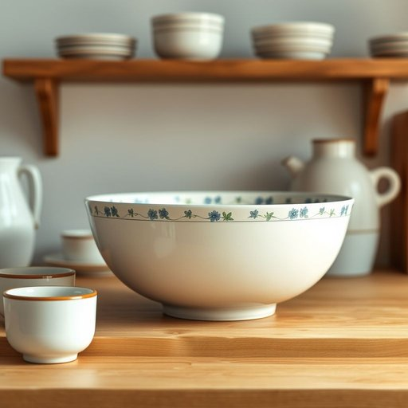

# soup-bowl

<h1 style="font-size: 2.5em; font-weight: 300; letter-spacing: 2px; margin: 0; color: #2c3e50;">
/soup-bowl*/
</h1>

---

---

## 例句

In the bustling kitchen, the large ceramic soup-bowl displayed a delicate blue floral pattern around its rim, resting steadily on the top shelf beside the mugs, ready to be filled with steaming homemade vegetable soup before it cooled.

*In(/ɪn/) the(/ðə/) bustling(/ˈbəsəlɪŋ/) kitchen,(/ˈkɪʧən,/) the(/ðə/) large(/lɑrʤ/) ceramic(/sərˈæmɪk/) soup-bowl(/soup-bowl*/) displayed(/dɪˈspleɪd/) a(/ə/) delicate(/ˈdɛləkət/) blue(/blu/) floral(/ˈflɔrəl/) pattern(/ˈpætərn/) around(/əraʊnd/) its(/ɪts/) rim,(/rɪm,/) resting(/ˈrɛstɪŋ/) steadily(/ˈstɛdəli/) on(/ɔn/) the(/ðə/) top(/tɔp/) shelf(/ʃɛlf/) beside(/ˌbiˈsaɪd/) the(/ðə/) mugs,(/məgz,/) ready(/ˈrɛdi/) to(/tɪ/) be(/bi/) filled(/fɪld/) with(/wɪθ/) steaming(/ˈstimɪŋ/) homemade(/ˈhoʊˈmeɪd/) vegetable(/ˈvɛʤtəbəl/) soup(/sup/) before(/ˌbiˈfɔr/) it(/ɪt/) cooled.(/kuld./)*

**翻译：** 在繁忙的厨房里，那只大号陶瓷汤碗的边缘饰有精致的蓝色花卉图案，稳稳地摆放在靠近马克杯的顶层架子上，随时准备盛装热气腾腾的自制蔬菜汤，趁热未凉时享用。

---

## 解释

英语单词'soup-bowl'在家居生活用品语境中作为名词，指的是专门用来盛装汤类的碗，一般比普通碗要宽口且容量适中，方便盛放液体且便于饮用。具体使用场合通常是用餐时，特别是在西餐或家庭日常饮食中，用于盛放各种汤品如蔬菜汤、鸡汤或奶油汤；也出现在餐具分类、家居用品购买等语境中。英语学习者需要注意“soup-bowl”作为复合名词时通常连写或用连字符连接，且前半部分的soup作定语使用，整体指代具体物品；在语法上可直接作为可数名词单数或复数（soups bowls或soup bowls）出现。常见搭配有“a set of soup bowls”（一套餐具中的几只汤碗）、“a large soup bowl”（一个大号汤碗）等。词源上，“soup”来源于古法语“soupe”，意为汤，而“bowl”源自古英语“bolla”，表示碗，这两个词合成一个复合词，直接表达了碗用来盛汤的功能。中文中准确翻译为“汤碗”，这是最为标准且通用的表达，强调其专用性，没有明显贬义或褒义，属于中性词汇，常见于餐厅、厨房设备介绍或者家庭生活用具描述中。在文化内涵上，汤碗体现了西方餐桌礼仪中对器皿功能细分的习惯，与中式餐具中多用途碗的使用有所不同。

---

<small style="color: #999; font-size: 0.9em;">2025-07-17 06:22:40</small>

