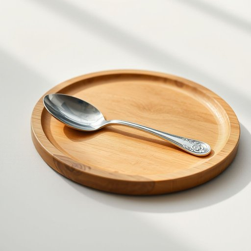

# soup-spoon

<h1 style="font-size: 2.5em; font-weight: 300; letter-spacing: 2px; margin: 0; color: #2c3e50;">
/soup-spoon*/
</h1>

---

---

## 例句

Although the soup-spoon was merely one piece among the polished silverware inherited from her grandmother, its intricate floral engravings made it the most cherished utensil when she carefully placed it beside each bowl on the dining table for the family dinner.

*Although(/ˌɔlˈðoʊ/) the(/ðə/) soup-spoon(/soup-spoon*/) was(/wɑz/) merely(/ˈmɪrli/) one(/wən/) piece(/pis/) among(/əˈməŋ/) the(/ðə/) polished(/ˈpɑlɪʃt/) silverware(/ˈsɪlvərˌwɛr/) inherited(/ˌɪnˈhɛrətɪd/) from(/frəm/) her(/hər/) grandmother,(/ˈgrændˌməðər,/) its(/ɪts/) intricate(/ˈɪntrəkət/) floral(/ˈflɔrəl/) engravings(/ɪnˈgreɪvɪŋz/) made(/meɪd/) it(/ɪt/) the(/ðə/) most(/moʊst/) cherished(/ˈʧɛrɪʃt/) utensil(/juˈtɛnsəl/) when(/wɪn/) she(/ʃi/) carefully(/ˈkɛrfəli/) placed(/pleɪst/) it(/ɪt/) beside(/ˌbiˈsaɪd/) each(/iʧ/) bowl(/boʊl/) on(/ɔn/) the(/ðə/) dining(/ˈdaɪnɪŋ/) table(/ˈteɪbəl/) for(/fər/) the(/ðə/) family(/ˈfæməli/) dinner.(/ˈdɪnər./)*

**翻译：** 虽然汤匙不过是她从祖母那里继承的一套银器中的一件，但其精致的花卉雕纹使它成为用餐时最珍爱的餐具。她每次为家庭晚餐将它小心翼翼地摆放在每只碗边，心中都倍感珍惜。

---

## 解释

英语单词'soup-spoon'作为名词主要指用于舀取和食用汤类的勺子，通常比普通茶匙或餐匙更大更宽，形状设计便于盛取汤汁和块状汤料。在家居生活用品的语境中，这个词常见于餐具分类、厨房用品介绍或点餐时描述餐具需求。英语学习者使用'soup-spoon'时需注意其构成是复合名词，通常连写或用连字符连接，复数形式为'soup-spoons'，且多用来指具体餐具而非抽象概念。常见搭配包括"set of soup spoons"（一套餐勺）、"use a soup spoon"（使用汤匙）等，表达时需避开与更通用的spoon混淆，以体现针对汤的专用性。词源上，soup来自古法语soupe，意为汤，spoon源于古英语'spon'，原指木片或用作舀取器具，'soup-spoon'结合体现了专用于汤的勺子这一功能属性。在中文语境中，准确翻译即为“汤匙”或“汤勺”，是餐桌上吃汤的专用勺子，区别于一般的餐勺或茶匙，无特殊褒贬色彩或文化隐含，属于中性且实用的生活用具术语。

---

<small style="color: #999; font-size: 0.9em;">2025-07-17 06:22:40</small>

