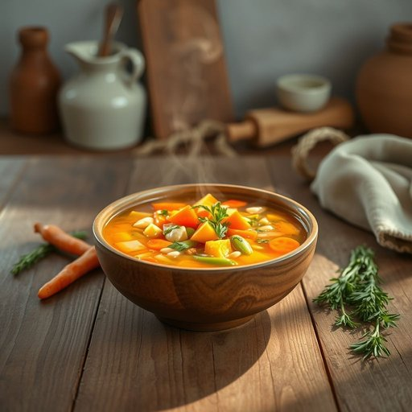

# soup

<h1 style="font-size: 2.5em; font-weight: 300; letter-spacing: 2px; margin: 0; color: #2c3e50;">
/sup/
</h1>

---

---

## 例句

After the sudden storm forced us to seek shelter inside the ancient library, the fragile manuscript, containing invaluable historical knowledge, was carefully preserved by the dedicated librarian who worked tirelessly through the night.

*After(/ˈæftər/) the(/ðə/) sudden(/ˈsədən/) storm(/stɔrm/) forced(/fɔrst/) us(/ˈjuˈɛs/) to(/tɪ/) seek(/sik/) shelter(/ˈʃɛltər/) inside(/ˌɪnˈsaɪd/) the(/ðə/) ancient(/ˈeɪnʧənt/) library,(/ˈlaɪbrɛˌri,/) the(/ðə/) fragile(/ˈfræʤəl/) manuscript,(/ˈmænjəˌskrɪpt,/) containing(/kənˈteɪnɪŋ/) invaluable(/ˌɪnˈvæljəbəl/) historical(/hɪˈstɔrɪkəl/) knowledge,(/ˈnɑlɪʤ,/) was(/wɑz/) carefully(/ˈkɛrfəli/) preserved(/prɪˈzərvd/) by(/baɪ/) the(/ðə/) dedicated(/ˈdɛdəkeɪtəd/) librarian(/laɪˈbrɛˌriən/) who(/hu/) worked(/wərkt/) tirelessly(/ˈtaɪrləsli/) through(/θru/) the(/ðə/) night.(/naɪt./)*

**翻译：** 突如其来的暴风雨迫使我们躲进了古老的图书馆，那份脆弱的手稿蕴含着宝贵的历史知识，被夜以继日辛勤工作的图书管理员细心保护着。

---

## 解释

英语单词'soup'在家居生活用品的语境中作为名词，通常指用水或高汤煮制的液态食品，包含各种蔬菜、肉类或豆类等成分，常见于餐桌上的开胃菜或主食之一。使用场合多为家庭厨房、餐厅、超市购物或烹饪对话中，如描述食谱、购买清单或饮食习惯时。英语学习者需要注意soup作为不可数名词时侧重整体概念，但也可作为可数名词使用，表示一种具体或一种不同口味的汤，如"a bowl of soup"（一碗汤）或"a chicken soup"（一份鸡汤）；常见搭配包括"hot soup"（热汤）、"chicken soup"（鸡汤）、"vegetable soup"（蔬菜汤）、"cream soup"（奶油汤）等，表达时可用形容词修饰种类、温度、口感等。语法上，soup一般用作单数，复数形式"soups"表示多种汤类。该词源自古法语"soupe"，意为“汤汁浸泡的面包”，进一步来自拉丁语"suppa"，指“浸泡的面包”，反映出最初汤类食品与面包佐食的关系。中文中，"soup"准确翻译为“汤”，在家居生活中多指可食用的液体食物，不同于“羹”或“粥”在质地上的区分，强调液态且通常有肉类或蔬菜成分。需要注意的是，英语中的"soup"一般无特殊褒贬色彩，属于中性词，但文化上某些汤品如“chicken soup”常被赋予滋补或安慰意味；在某些比喻用法中，soup有时象征复杂混合物，然而在家居生活用品场景下通常仅指食品本义。

---

<small style="color: #999; font-size: 0.9em;">2025-07-17 06:22:40</small>

