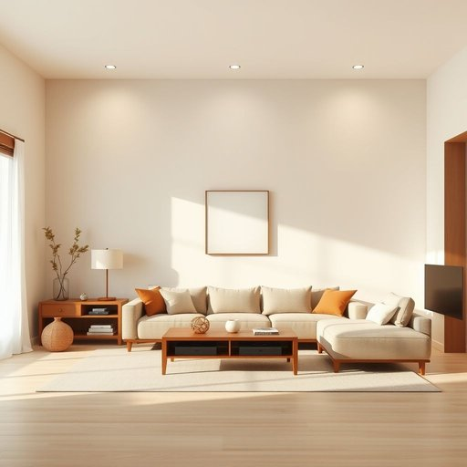

# space

<h1 style="font-size: 2.5em; font-weight: 300; letter-spacing: 2px; margin: 0; color: #2c3e50;">
/speɪs/
</h1>

---

---

## 例句

The thinking behind the decision was so intricate that it involved numerous layers of analysis, reflection, and strategic planning to ensure every possible outcome was considered.

*The(/ðə/) thinking(/ˈθɪŋkɪŋ/) behind(/bɪˈhaɪnd/) the(/ðə/) decision(/dɪˈsɪʒən/) was(/wɑz/) so(/soʊ/) intricate(/ˈɪntrəkət/) that(/ðət/) it(/ɪt/) involved(/ˌɪnˈvɑlvd/) numerous(/ˈnumərəs/) layers(/leɪərz/) of(/əv/) analysis,(/æˈnælɪsɪs,/) reflection,(/rɪˈflɛkʃən,/) and(/ənd/) strategic(/strəˈtiʤɪk/) planning(/ˈplænɪŋ/) to(/tɪ/) ensure(/ɪnˈʃʊr/) every(/ˈɛvəri/) possible(/ˈpɑsəbəl/) outcome(/ˈaʊtˌkəm/) was(/wɑz/) considered.(/kənˈsɪdərd./)*

**翻译：** 这一决策背后的思考极为复杂，涵盖了多层次的分析、反思与战略规划，以确保对每一种可能的结果都予以充分考量。

---

## 解释

在家居生活用品的语境中，英语单词“space”作为名词主要指物理空间或区域，用来描述房间、家具或物品之间可用或留出的空隙，例如“living space”（居住空间）、“storage space”（储物空间）或“space under the bed”（床下空间）。使用时，学习者应注意其不可数名词性质，通常不加复数形式，且常与介词搭配，如“in the space of”（在……范围内）、“make space for”（为……腾出空间）、“use up space”（占用空间）等常见搭配。词源方面，“space”源自拉丁语“spatium”，意为“距离、空间”，传入英语后沿用至今，涵义较为稳定。在中文环境中，“space”一般准确翻译为“空间”，强调的是具体的、实际存在的物理范围，不含隐喻或特殊褒贬意义。在家居用品或布置场景中，正确理解“space”有助于明确物品摆放、收纳及利用效率，避免混淆为抽象的宇宙空间。该词在此语境中中性且实用，无特殊文化色彩，但因其涵盖面广，使用时需结合具体情境以避免歧义。

---

<small style="color: #999; font-size: 0.9em;">2025-07-17 06:22:40</small>

