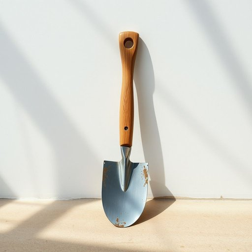

# spade

<h1 style="font-size: 2.5em; font-weight: 300; letter-spacing: 2px; margin: 0; color: #2c3e50;">
/speɪd/
</h1>

---

---

## 例句

Could you please hand me the spade that’s leaning against the greenhouse, the one with the worn wooden handle and slightly rusted blade, so I can finally finish planting the tulip bulbs before the rain starts?

*Could(/kʊd/) you(/ju/) please(/pliz/) hand(/hænd/) me(/mi/) the(/ðə/) spade(/speɪd/) that’s(/that’s*/) leaning(/ˈlinɪŋ/) against(/əˈgɛnst/) the(/ðə/) greenhouse,(/ˈgrinˌhaʊs,/) the(/ðə/) one(/wən/) with(/wɪθ/) the(/ðə/) worn(/wɔrn/) wooden(/ˈwʊdən/) handle(/ˈhændəl/) and(/ənd/) slightly(/sˈlaɪtli/) rusted(/ˈrəstɪd/) blade,(/bleɪd,/) so(/soʊ/) I(/aɪ/) can(/kən/) finally(/ˈfaɪnəli/) finish(/ˈfɪnɪʃ/) planting(/ˈplæntɪŋ/) the(/ðə/) tulip(/ˈtulɪp/) bulbs(/bəlbz/) before(/ˌbiˈfɔr/) the(/ðə/) rain(/reɪn/) starts?(/stɑrts?/)*

**翻译：** 请把靠在温室旁的那把铁锹递给我，就是那把木柄稍显磨损、铁铲带些锈迹的，这样我才能在雨开始落下前，终于完成郁金香球茎的种植。

---

## 解释

英语单词“spade”作为名词在家居生活用品的语境中，指的是一种用来挖土、移植植物或清理花园的铲子，通常具有扁平且略带弧度的金属铲头和长柄，广泛用于园艺和户外劳动，具体使用场合多见于园艺、农业和家庭庭院管理中，如“use a spade to dig a hole for planting”（用铲子挖一个坑种植），英语学习者在使用“spade”时需注意，它是可数名词，常用单数和复数形式（spades），常见的搭配有“garden spade”（园艺铲）、“dig with a spade”（用铲子挖土）、“spade handle”（铲柄）等，此外，“spade”作为名词没有复杂的语法变化，但需区分与同音词及其他含义，如扑克牌中的黑桃（spade）区别开来，词源方面，“spade”源自古英语“spadu”或“spæd”，意指挖土工具，源远流长，体现了其作为手工工具的传统和实用性，在中文语境中，“spade”准确翻译为“铲子”或“铁锹”，其中“铲子”更为通用，强调其用于挖掘和移土的功能，属于家居园艺类常见工具，需要注意，“spade”作为工具本身没有褒贬含义，但在英语口语或俚语中，某些短语含有不雅用法，使用时应结合语境谨慎辨别，整体而言，“spade”在家居生活用品语境下，是一个实用性强、涵义明确的名词，学习时应注重其工具属性及相关搭配。

---

<small style="color: #999; font-size: 0.9em;">2025-07-17 06:22:40</small>

