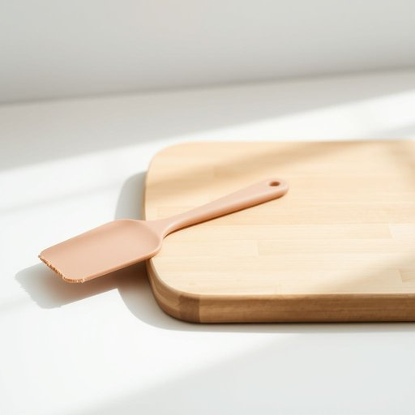

# spatula

<h1 style="font-size: 2.5em; font-weight: 300; letter-spacing: 2px; margin: 0; color: #2c3e50;">
/ˈspæˌʧʊlə/
</h1>

---

---

## 例句

Could you please hand me the spatula that’s lying next to the cutting board on the kitchen counter, the one with the slightly worn silicone edge which I use specifically for folding delicate batter without deflating it?

*Could(/kʊd/) you(/ju/) please(/pliz/) hand(/hænd/) me(/mi/) the(/ðə/) spatula(/ˈspæˌʧʊlə/) that’s(/that’s*/) lying(/laɪɪŋ/) next(/nɛkst/) to(/tɪ/) the(/ðə/) cutting(/ˈkətɪŋ/) board(/bɔrd/) on(/ɔn/) the(/ðə/) kitchen(/ˈkɪʧən/) counter,(/ˈkaʊntər,/) the(/ðə/) one(/wən/) with(/wɪθ/) the(/ðə/) slightly(/sˈlaɪtli/) worn(/wɔrn/) silicone(/ˈsɪləˌkoʊn/) edge(/ɛʤ/) which(/wɪʧ/) I(/aɪ/) use(/juz/) specifically(/spəˈsɪfɪkli/) for(/fər/) folding(/ˈfoʊldɪŋ/) delicate(/ˈdɛləkət/) batter(/ˈbætər/) without(/wɪˈθaʊt/) deflating(/dɪˈfleɪtɪŋ/) it?(/ɪt?/)*

**翻译：** 请把厨房台面切菜板旁边那把刮刀递给我，就是那把带有稍微磨损的硅胶边缘的刮刀，我专门用它来轻柔地翻拌细腻的面糊，以免面糊消泡。

---

## 解释

单词“spatula”在家居生活用品语境中作为名词，指的是一种用于厨房烹饪或食品加工的扁平工具，通常有细长的带有柔软或硬质的宽面，用来翻转、刮取或涂抹食物，如煎饼、蛋糕糊或酱料。具体使用场合多为家庭厨房或餐饮场景，如烹饪时翻动煎炸食物，或者蛋糕制作时均匀涂抹奶油。英语学习者在使用“spatula”时需注意它通常为可数名词，复数形式为“spatulas”，常见搭配有“rubber spatula”（橡胶刮刀）、“metal spatula”（金属刮铲）、“flipping spatula”（翻面铲），且在美式英语中“spatula”有时与“turner”或“flipper”含义重叠，但“spatula”强调刮抹功能，“turner”更偏重翻面动作。词源方面，“spatula”源自拉丁语“spatula”，意为“小铲子或薄片”，体现了其扁平、铲状的形态特征。中文语境中，“spatula”常被译为“抹刀”、“刮刀”或“铲刀”，根据具体工具材质和用途不同而异，需根据使用对象恰当选择，因为“铲子”在中文中一般指更大型的工具，而“抹刀”更具精准意义，且无褒贬色彩，属于中性实用词汇，无明显文化内涵或特殊语言色彩。

---

<small style="color: #999; font-size: 0.9em;">2025-07-17 06:22:40</small>

