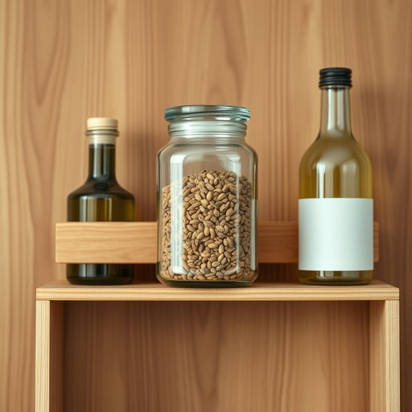

# spice-jar

<h1 style="font-size: 2.5em; font-weight: 300; letter-spacing: 2px; margin: 0; color: #2c3e50;">
/spice-jar*/
</h1>

---

---

## 例句

Could you please pass me the spice-jar that’s tucked behind the olive oil and the vinegar on the top shelf of the pantry, since I need to add a pinch of cumin to the curry we’re preparing for dinner tonight?

*Could(/kʊd/) you(/ju/) please(/pliz/) pass(/pæs/) me(/mi/) the(/ðə/) spice-jar(/spice-jar*/) that’s(/that’s*/) tucked(/təkt/) behind(/bɪˈhaɪnd/) the(/ðə/) olive(/ˈɑlɪv/) oil(/ɔɪl/) and(/ənd/) the(/ðə/) vinegar(/ˈvɪnəgər/) on(/ɔn/) the(/ðə/) top(/tɔp/) shelf(/ʃɛlf/) of(/əv/) the(/ðə/) pantry,(/ˈpæntri,/) since(/sɪns/) I(/aɪ/) need(/nid/) to(/tɪ/) add(/æd/) a(/ə/) pinch(/pɪnʧ/) of(/əv/) cumin(/ˈkjumən/) to(/tɪ/) the(/ðə/) curry(/ˈkəri/) we’re(/we’re*/) preparing(/pərˈpɛrɪŋ/) for(/fər/) dinner(/ˈdɪnər/) tonight?(/təˈnaɪt?/)*

**翻译：** 请你帮我拿一下储藏室顶层架子上藏在橄榄油和醋后面的那个香料罐好吗？因为我需要往我们今晚准备的咖喱里加一点孜然。

---

## 解释

spice-jar作为名词，主要指用于存放香料的小容器或罐子，常见于厨房或餐厅环境中，方便储藏和使用各种调味料，如胡椒粉、肉桂粉等。在家居生活用品的语境下，spice-jar一般出现于描述厨房收纳、烹饪准备或餐桌布置的情境，如“Please pass me the spice-jar”意为“请把那个香料罐递给我”。英语学习者在使用该词时要注意其复合结构，通常为名词短语，可作单数或复数（spice-jars），且前半部分spice限定后半部分jar，表明罐子内装的是香料。此外，常见搭配包括“a set of spice-jars”（一套香料罐）、“glass spice-jar”（玻璃香料罐）等，表达时要注意冠词和数量的对应。该词源于spice（香料）和jar（罐子）的合成，反映了英语中复合名词命名物品时的常见构词方式。文化上，spice-jar作为中性词汇，无特别褒贬色彩，但因香料在不同饮食文化中的重要性，香料罐的样式有时也象征厨艺或生活品质。在中文语境中，spice-jar准确翻译为“香料罐”或“香料瓶”，强调储藏香料的容器，便于理解和实用。因此，理解spice-jar不仅是掌握物品名称，更涉及厨房生活细节和烹饪文化。

---

<small style="color: #999; font-size: 0.9em;">2025-07-17 06:22:40</small>

