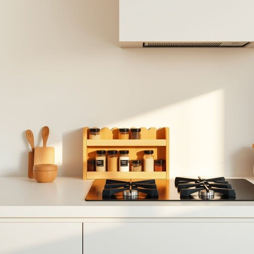

# spice-rack

<h1 style="font-size: 2.5em; font-weight: 300; letter-spacing: 2px; margin: 0; color: #2c3e50;">
/spice-rack*/
</h1>

---

---

## 例句

Could you please move the spice-rack closer to the stove, where it’s not only more convenient for cooking but also safer to keep all the herbs and seasonings in one organized place, especially considering how cluttered the countertop has become with all the new gadgets we’ve bought recently?

*Could(/kʊd/) you(/ju/) please(/pliz/) move(/muv/) the(/ðə/) spice-rack(/spice-rack*/) closer(/ˈkloʊzər/) to(/tɪ/) the(/ðə/) stove,(/stoʊv,/) where(/wɛr/) it’s(/it’s*/) not(/nɑt/) only(/ˈoʊnli/) more(/mɔr/) convenient(/kənˈvinjənt/) for(/fər/) cooking(/ˈkʊkɪŋ/) but(/bət/) also(/ˈɔlsoʊ/) safer(/ˈseɪfər/) to(/tɪ/) keep(/kip/) all(/ɔl/) the(/ðə/) herbs(/ərbz/) and(/ənd/) seasonings(/ˈsizənɪŋz/) in(/ɪn/) one(/wən/) organized(/ˈɔrgəˌnaɪzd/) place,(/pleɪs,/) especially(/əˈspɛʃəli/) considering(/kənˈsɪdərɪŋ/) how(/haʊ/) cluttered(/ˈklətərd/) the(/ðə/) countertop(/ˈkaʊntərˌtɑp/) has(/həz/) become(/bɪˈkəm/) with(/wɪθ/) all(/ɔl/) the(/ðə/) new(/nu/) gadgets(/ˈgæʤəts/) we’ve(/we’ve*/) bought(/bɔt/) recently?(/ˈrisəntli?/)*

**翻译：** 请您把调料架移近炉灶，那里不仅烹饪更方便，也更安全，可以将各种香料和调味品整齐地集中存放，尤其是考虑到我们最近添置了许多新厨具，台面已经变得相当杂乱。

---

## 解释

英语单词spice-rack作为名词，指的是一种用于存放各种香料瓶的小型架子，常见于厨房内。它的具体使用场合主要是家庭厨房或餐厅中，用来方便地摆放和取用调味料，帮助厨房工作井然有序，通常放置于灶台旁边或橱柜内。对于英语学习者来说，spice-rack通常作可数名词使用，常见的搭配有a spice-rack（一个香料架）、a wooden/metal/plastic spice-rack（木制/金属/塑料香料架），且多用于书面和口语中日常生活场景的描述，其构成是复合名词，前半部分spice作为名词修饰后半部分rack，整体作为单一名词使用，注意连字符的使用以避免歧义。词源上，spice-rack由spice（香料）和rack（架子）组合而成，rack源自古英语racc意为架子或搁物架，spice一词则来自拉丁语species，意指香料或货物，二者合成直接反映其功能用途，即放置香料的架子。在中文语境中，spice-rack准确的翻译是香料架或调味架，指家居生活中用于整齐摆放各种香料瓶的小架子，既凸显其实用性，也符合语境中厨房收纳的表达。该词语本身无特殊褒贬色彩，属于中性、实用的生活用语，反映的是厨房用品的分类和整洁管理习惯，常见于家居生活、厨房设计和烹饪相关话题中。

---

<small style="color: #999; font-size: 0.9em;">2025-07-17 06:22:40</small>

