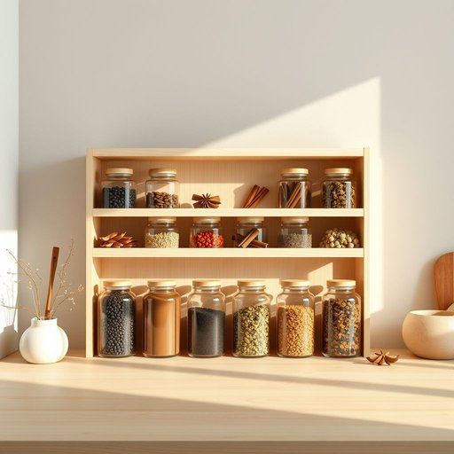

# spice

<h1 style="font-size: 2.5em; font-weight: 300; letter-spacing: 2px; margin: 0; color: #2c3e50;">
/spaɪs/
</h1>

---

---

## 例句

Could you explain how the concept of justice is applied differently in various cultural contexts during international negotiations to ensure fair agreements?

*Could(/kʊd/) you(/ju/) explain(/ɪkˈspleɪn/) how(/haʊ/) the(/ðə/) concept(/ˈkɑnsɛpt/) of(/əv/) justice(/ˈʤəstɪs/) is(/ɪz/) applied(/əˈplaɪd/) differently(/ˈdɪfərˈɛntli/) in(/ɪn/) various(/ˈvɛriəs/) cultural(/ˈkəlʧərəl/) contexts(/ˈkɑnˌtɛksts/) during(/ˈdʊrɪŋ/) international(/ˌɪnərˈnæʃənɑl/) negotiations(/nɪˌgoʊʃiˈeɪʃənz/) to(/tɪ/) ensure(/ɪnˈʃʊr/) fair(/fɛr/) agreements?(/əˈgrimənts?/)*

**翻译：** 您能否解释在国际谈判中，正义的概念如何在不同文化背景下被区别应用，以确保达成公平的协议？

---

## 解释

英语单词“spice”作为名词在家居生活用品的语境中，通常指用来调味的各种香料，如胡椒、肉桂、丁香等，常见于厨房用品、烹饪材料或调味品类别中。具体使用场合多是在描述食物的调味成分、厨房储藏或者烹饪过程，例如“一罐香料”或“烹饪用香料”。学习者需要注意“spice”作为可数或不可数名词的用法：当泛指各种香料时一般用不可数形式“spice”，如“spice adds flavor to food”，而当指具体种类时常用复数“spices”，如“cinnamon and cloves are spices”。常见搭配包括“spice rack”（香料架）、“spice jar”（香料瓶）、“spice blend”（香料混合物）等。词源上，“spice”来自拉丁语“species”，意为“种类”或“商品”，经过古法语和中古英语演变，最初指贵重的异国香料，历史上因香料贸易的重要性而广泛使用。中文语境中，“spice”准确翻译为“香料”，强调其作为调味材料的功能，区别于“调料”则更为宽泛，且“spice”通常指天然植物性香料，带有提升食物风味的积极色彩，无褒贬含义，属于中性词汇，在家庭生活中常见且实用。

---

<small style="color: #999; font-size: 0.9em;">2025-07-17 06:22:40</small>

