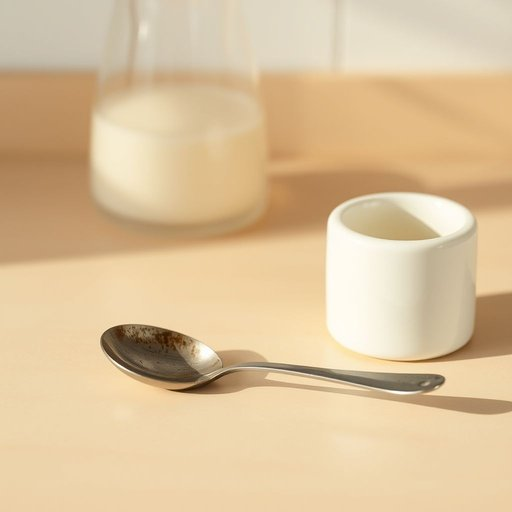

# spoon

<h1 style="font-size: 2.5em; font-weight: 300; letter-spacing: 2px; margin: 0; color: #2c3e50;">
/spun/
</h1>

---

---

## 例句

Could you please pass me the spoon that’s lying next to the sugar bowl on the kitchen counter, the one with the slightly tarnished handle that Gran always insists we use for her special morning porridge?

*Could(/kʊd/) you(/ju/) please(/pliz/) pass(/pæs/) me(/mi/) the(/ðə/) spoon(/spun/) that’s(/that’s*/) lying(/laɪɪŋ/) next(/nɛkst/) to(/tɪ/) the(/ðə/) sugar(/ˈʃʊgər/) bowl(/boʊl/) on(/ɔn/) the(/ðə/) kitchen(/ˈkɪʧən/) counter,(/ˈkaʊntər,/) the(/ðə/) one(/wən/) with(/wɪθ/) the(/ðə/) slightly(/sˈlaɪtli/) tarnished(/ˈtɑrnɪʃt/) handle(/ˈhændəl/) that(/ðət/) Gran(/græn/) always(/ˈɔlˌweɪz/) insists(/ˌɪnˈsɪsts/) we(/wi/) use(/juz/) for(/fər/) her(/hər/) special(/ˈspɛʃəl/) morning(/ˈmɔrnɪŋ/) porridge?(/ˈpɔrəʤ?/)*

**翻译：** 请帮我递一下厨房台面上放在糖罐旁边的那把勺子，就是柄稍微有些暗淡的那把，奶奶总坚持用它来盛她特别的早晨粥。

---

## 解释

英语单词“spoon”作为名词在家居生活用品语境中，指的是一种常见的餐具，通常由金属、塑料或木头制成，具有一个中空的圆形或椭圆形勺头和一根柄，用于舀取、搅拌或盛放液体和半固体食物，如汤、粥、糖、调味品等，其使用场合通常包括餐桌上用餐、烹饪过程中取食材或饮用汤汁等。英语学习者在使用“spoon”时需注意，作为可数名词，其复数形式为“spoons”，且常见搭配有“a spoon of sugar”（一勺糖）、“a teaspoon”（茶匙）、“a tablespoon”（汤匙），前者常用于计量，后两者则是不同大小的勺子类别，此外，“spoon”也可以引申出动词用法，表示用勺子舀食物，但这在语法上区别明显。词源方面，“spoon”源自古英语“spōn”，意为用来舀取的木片或小条，与日耳曼语族其他语言中的对应词同源，反映其最初由木制材料制成的历史背景。中文语境中，“spoon”通常译为“勺子”，是日常生活中必备的餐具之一，准确理解为“用于舀取食物的餐具”即可；不存在褒义或贬义色彩，文化上其形象和功能较为中性，但在某些习语中，如“spoon-feeding”（喂饭式教导），则带有比喻意义，暗指过度保护或过分指导，因此学习者应主要关注其作为“勺子”的基本词义和典型用法。

---

<small style="color: #999; font-size: 0.9em;">2025-07-17 06:22:40</small>

