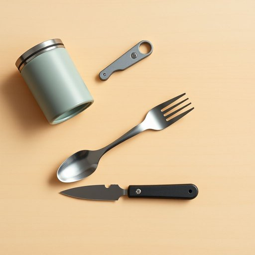

# spork

<h1 style="font-size: 2.5em; font-weight: 300; letter-spacing: 2px; margin: 0; color: #2c3e50;">
/spork*/
</h1>

---

---

## 例句

Could you please check the pantry to see if we've got any spork left, because when we go camping this weekend, it would be much more convenient to use a spork—which combines a spoon and a fork—rather than carrying multiple utensils, especially given how compact and lightweight it is compared to standard cutlery?

*Could(/kʊd/) you(/ju/) please(/pliz/) check(/ʧɛk/) the(/ðə/) pantry(/ˈpæntri/) to(/tɪ/) see(/si/) if(/ɪf/) we've(/wiv/) got(/gɑt/) any(/ˈɛni/) spork(/spork*/) left,(/lɛft,/) because(/bɪˈkəz/) when(/wɪn/) we(/wi/) go(/goʊ/) camping(/ˈkæmpɪŋ/) this(/ðɪs/) weekend,(/ˈwiˌkɪnd,/) it(/ɪt/) would(/wʊd/) be(/bi/) much(/məʧ/) more(/mɔr/) convenient(/kənˈvinjənt/) to(/tɪ/) use(/juz/) a(/ə/) spork—which(/spork—which*/) combines(/kəmˈbaɪnz/) a(/ə/) spoon(/spun/) and(/ənd/) a(/ə/) fork—rather(/fork—rather*/) than(/ðən/) carrying(/ˈkɛriɪŋ/) multiple(/ˈməltəpəl/) utensils,(/juˈtɛnsəlz,/) especially(/əˈspɛʃəli/) given(/ˈgɪvɪn/) how(/haʊ/) compact(/ˈkɑmpækt/) and(/ənd/) lightweight(/ˈlaɪtˈweɪt/) it(/ɪt/) is(/ɪz/) compared(/kəmˈpɛrd/) to(/tɪ/) standard(/ˈstændərd/) cutlery?(/ˈkətləri?/)*

**翻译：** 请你帮忙检查一下储藏室，看看有没有剩余的叉勺。因为我们这周末去野营时，使用叉勺——一种合并了勺子和叉子的餐具——会更加方便，尤其是相比普通餐具，它更轻便小巧，不必携带多种餐具。

---

## 解释

英语单词'spork'作为名词，在家居生活用品的英语学习语境中并不常见且非标准词汇，实际上这个词最初是由“spoon”（勺子）和“fork”（叉子）合成的合成词，用来指代一种结合了勺子和叉子功能的餐具，类似于中文中的“叉勺”或“叉匙”。具体使用场合一般出现在描述便携式餐具、户外用具或儿童餐具时，比如野营用餐工具或学校午餐盒中的多功能餐具。英语学习者在使用时需要注意，‘spork’作为可数名词时通常用复数‘sports’，且多用于特定语境，避免随意使用以免导致交流误解。常见搭配有“plastic spork”（塑料叉勺）、“camping spork”（露营叉勺）等，并常与“knife”或“tableware”（餐具）连用。词源方面，‘spork’起源于20世纪初，是合成新词体现了现代生活中对多功能便携餐具的需求，属于形象合成词，有一定的幽默感和创新色彩。中文翻译一般为“叉勺”或“多功能叉勺”，理解时应结合具体应用场景，避免直译为“猪肉和火腿的混合肉制品”（另一含义中的‘spork’即“猪肉火腿混合肉”）的误解。在文化层面，‘spork’作为餐具名称相对中性，无褒贬含义，主要体现实用性和便利性，但在日常英语中仍属非正式或口语用词，更常见于北美和户外生活语境。

---

<small style="color: #999; font-size: 0.9em;">2025-07-17 06:22:40</small>

