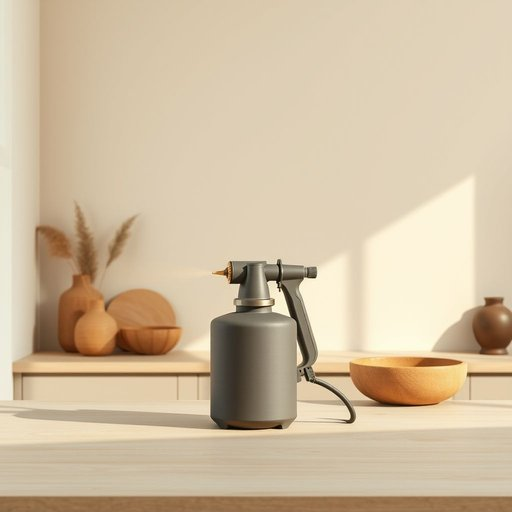

# sprayer

<h1 style="font-size: 2.5em; font-weight: 300; letter-spacing: 2px; margin: 0; color: #2c3e50;">
/spreɪər/
</h1>

---

---

## 例句

Before you start painting the kitchen walls, make sure to fill the sprayer with the correct type of paint and test it on a small, inconspicuous patch to avoid any uneven coverage or accidental drips that could damage the new countertops.

*Before(/ˌbiˈfɔr/) you(/ju/) start(/stɑrt/) painting(/ˈpeɪnɪŋ/) the(/ðə/) kitchen(/ˈkɪʧən/) walls,(/wɔlz,/) make(/meɪk/) sure(/ʃʊr/) to(/tɪ/) fill(/fɪl/) the(/ðə/) sprayer(/spreɪər/) with(/wɪθ/) the(/ðə/) correct(/kərˈɛkt/) type(/taɪp/) of(/əv/) paint(/peɪnt/) and(/ənd/) test(/tɛst/) it(/ɪt/) on(/ɔn/) a(/ə/) small,(/smɔl,/) inconspicuous(/ˌɪŋˈkɑnspɪkwəs/) patch(/pæʧ/) to(/tɪ/) avoid(/əˈvɔɪd/) any(/ˈɛni/) uneven(/əˈnivən/) coverage(/ˈkəvərɪʤ/) or(/ər/) accidental(/ˌæksəˈdɛnəl/) drips(/drɪps/) that(/ðət/) could(/kʊd/) damage(/ˈdæmɪʤ/) the(/ðə/) new(/nu/) countertops.(/ˈkaʊntərˌtɑps./)*

**翻译：** 在开始粉刷厨房墙壁之前，请确保将喷枪装填适当的油漆类型，并先在一个不起眼的小区域进行测试，以避免出现喷涂不均或意外滴落，防止损坏新的台面。

---

## 解释

英语单词'sprayer'作为名词在家居生活用品的语境中，通常指用来喷洒液体的工具或装置，如喷雾瓶、喷壶等，广泛应用于喷洒清洁剂、植物水、消毒液等场合。使用时，英语学习者需注意该词为可数名词，常见搭配包括“a sprayer of disinfectant”（一瓶消毒喷雾）、“garden sprayer”（园艺喷雾器）等，句型中多作为主语或宾语出现，且通常与介词“with”（带有）或“for”（用于）连用。词源上，'sprayer'来自动词'spray'（喷洒）加后缀'-er'表示执行动作的工具或人，起源于拉丁语“aspers-”意为“洒”。在中文语境中，‘sprayer’准确翻译为“喷雾器”或“喷壶”，强调其功能为喷洒液体，无特别褒贬含义，属于中性词，常用于家居清洁或园艺护理中，体现实用性和便捷性。整体而言，该词在日常生活中使用频率较高，理解其具体应用和相关搭配对英语学习者掌握家居用品词汇极为有益。

---

<small style="color: #999; font-size: 0.9em;">2025-07-17 06:22:40</small>

