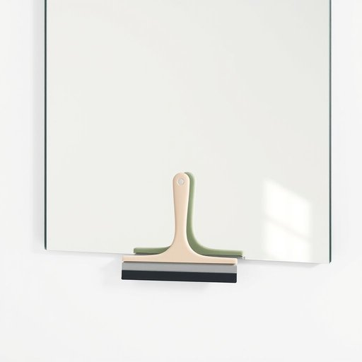

# squeegee

<h1 style="font-size: 2.5em; font-weight: 300; letter-spacing: 2px; margin: 0; color: #2c3e50;">
/skˈwiʤi/
</h1>

---

---

## 例句

After struggling for nearly an hour to get the bathroom mirror completely streak-free, I finally decided to use the squeegee, which, despite being underestimated as just a simple cleaning tool, proved indispensable by efficiently removing every drop of water and leaving the glass spotless and gleaming.

*After(/ˈæftər/) struggling(/ˈstrəgəlɪŋ/) for(/fər/) nearly(/ˈnɪrli/) an(/ən/) hour(/aʊər/) to(/tɪ/) get(/gɪt/) the(/ðə/) bathroom(/ˈbæθˌrum/) mirror(/ˈmɪrər/) completely(/kəmˈplitli/) streak-free,(/streak-free*,/) I(/aɪ/) finally(/ˈfaɪnəli/) decided(/ˌdɪˈsaɪdɪd/) to(/tɪ/) use(/juz/) the(/ðə/) squeegee,(/skˈwiʤi,/) which,(/wɪʧ,/) despite(/dɪˈspaɪt/) being(/biɪŋ/) underestimated(/ˈəndərˈɛstəˌmeɪtɪd/) as(/ɛz/) just(/ʤɪst/) a(/ə/) simple(/ˈsɪmpəl/) cleaning(/ˈklinɪŋ/) tool,(/tul,/) proved(/pruvd/) indispensable(/ˌɪndɪˈspɛnsəbəl/) by(/baɪ/) efficiently(/ɪˈfɪʃəntli/) removing(/riˈmuvɪŋ/) every(/ˈɛvəri/) drop(/drɔp/) of(/əv/) water(/ˈwɔtər/) and(/ənd/) leaving(/ˈlivɪŋ/) the(/ðə/) glass(/glæs/) spotless(/ˈspɑtləs/) and(/ənd/) gleaming.(/ˈglimɪŋ./)*

**翻译：** 经过将近一小时的努力，我终于决定使用刮水器。尽管它常被低估为只是一个简单的清洁工具，但它却不可或缺，高效地清除了每一滴水珠，使镜面洁净无瑕、闪亮如新。

---

## 解释

英语单词'squeegee'作为名词在家居生活用品的语境中，通常指一种用来擦除水迹、清洁平滑表面（如窗户、浴室镜子或瓷砖）的工具，主要由一个带有橡胶刮条的手柄组成，使用时通过刮除水分达到快速干净的效果。具体使用场合常见于家庭清洁、洗窗户、淋浴间排水或地板清洁等场景。英语学习者在使用该词时应注意它通常作为可数名词出现，复数形式为’squeegees’，并且常与动词like ‘use’, ‘grab’, ‘clean with’搭配，如“use a squeegee to clean the window”。此外，该词不宜与表示布类清洁工具的词混淆，如’towel’或’sponge’。词源方面，‘squeegee’最早来源于19世纪末，可能是拟声词，模仿擦拭时挤压橡胶条的声音，体现了工具的功能特点。中文中“squeegee”常被准确翻译为“刮水器”或“橡胶刮板”，强调其刮除水迹的功能，无明显褒贬色彩，是中性且实用的家居清洁工具名称。在中文语境里，通过“刮水器”这一译名可以清晰理解其用途和形态，有助于家居日常生活中的清洁操作效率。

---

<small style="color: #999; font-size: 0.9em;">2025-07-17 06:22:40</small>

